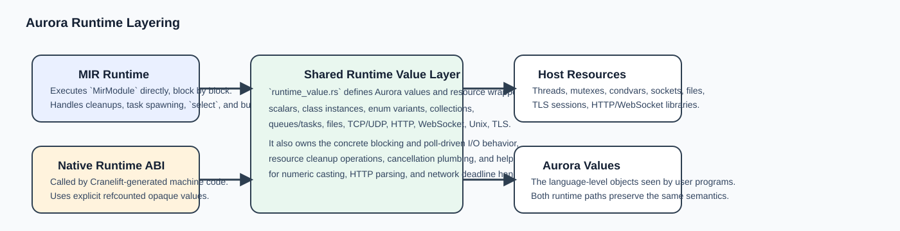
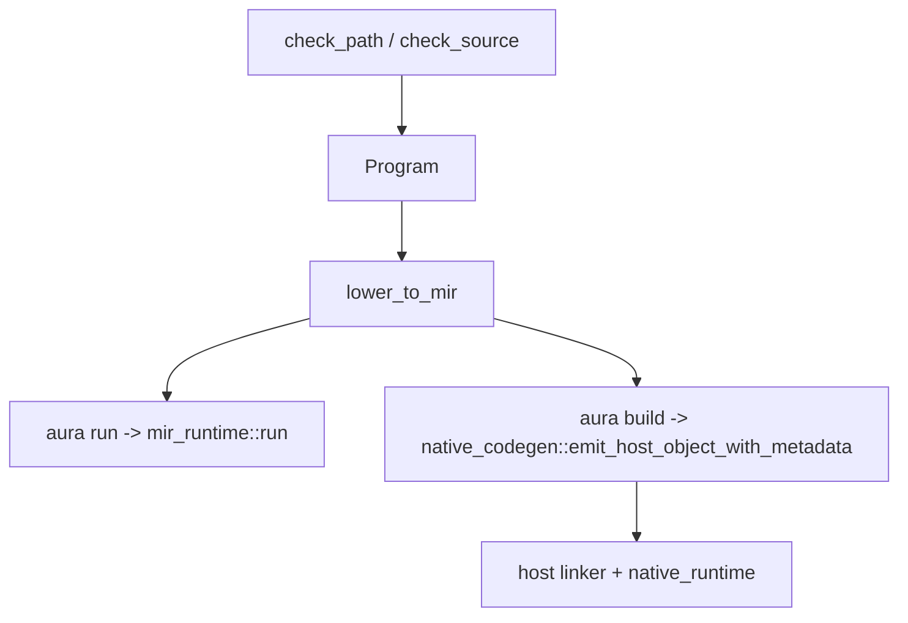

# System Overview

This chapter answers the question "what are the moving parts of Aurora, and how do they fit together?"

## Repository map

The repo is not just a compiler crate. It is a language implementation monorepo.

- `crates/aurora-compiler`
  The main compiler library: lexer, parser, semantic analysis, MIR, runtimes, native backend, package resolver, and analysis output.
- `crates/aura`
  The CLI driver that exposes `check`, `run`, `build`, `ast`, `mir`, `analyze`, `complete`, and `deps update`.
- `tools/aurora-language-server`
  The LSP server. It prefers compiler-backed intelligence.
- `tools/vscode-aurora`
  A thin VS Code client around the language server, plus indentation behavior and packaging.
- `examples/`
  Runnable language examples grouped by topic.
- `tutorials/`
  End-user docs for the implemented language subset.
- `work/`
  Task tracking and engineering notes.

## The architectural layers

Aurora's implementation is easiest to understand as five layers:

1. Source processing
   `lexer.rs`, `parser.rs`, and `ast.rs` turn text into syntax.
2. Semantic model
   `sema.rs` turns syntax into a checked `Program`.
3. Shared executable IR
   `mir.rs` lowers the checked program into MIR.
4. Execution backends
   `mir_runtime.rs` runs MIR directly, while `native_codegen.rs` and `native_runtime.rs` compile and run native binaries.
5. Tooling
   `analysis.rs`, the CLI, the language server, and the VS Code extension expose compiler information to humans and editors.

## One source tree, two execution paths

Aurora intentionally uses the same checked program and the same MIR as the starting point for both public execution modes.

That design matters because it keeps Aurora's semantics centralized:

- the parser and checker are shared
- MIR is the common execution contract
- the runtime value model is shared conceptually across both backends
- tests can compare behavior at the language surface instead of maintaining unrelated runtimes

## The main public entrypoints

The compiler library entrypoints live in [`lib.rs`](../crates/aurora-compiler/src/lib.rs).

- `parse_source`
  Text to AST.
- `check_source` / `check_path`
  AST to typed `Program`.
- `run_source` / `run_path`
  Check, lower to MIR, then execute in the MIR runtime.
- `lower_source_to_mir` / `lower_path_to_mir`
  Check, then lower into MIR.
- `analyze_path_source` / `complete_path_source`
  Produce machine-readable IDE data.
- `emit_host_native_object_with_metadata`
  Compile MIR into a host object file for native builds.

## What makes Aurora specific

Aurora is not "just another parser plus interpreter". The implementation has some repo-specific themes:

- significant indentation
  The lexer emits `Indent` and `Dedent`, so the parser works on explicit block tokens.
- ownership and borrowing checks
  The checker tracks moves, partial moves, mutable borrows, borrowed returns, and cleanup obligations.
- builtin namespaces as first-class imports
  `io`, `fs`, and `net` are modeled as module namespaces, not hard-coded special cases in every caller.
- shared call-binding rules
  Aurora binds positional and named arguments through the reusable logic in [`call.rs`](../crates/aurora-compiler/src/call.rs).
- MIR as the semantic hinge point
  Many high-level constructs become a smaller set of control-flow and call operations before execution.
- compiler-backed editor features
  The language server now treats the compiler as the primary semantic engine.

## The source-of-truth files

If you want to orient quickly in the implementation, start with these:

- [`crates/aurora-compiler/src/ast.rs`](../crates/aurora-compiler/src/ast.rs)
- [`crates/aurora-compiler/src/lexer.rs`](../crates/aurora-compiler/src/lexer.rs)
- [`crates/aurora-compiler/src/parser.rs`](../crates/aurora-compiler/src/parser.rs)
- [`crates/aurora-compiler/src/sema.rs`](../crates/aurora-compiler/src/sema.rs)
- [`crates/aurora-compiler/src/mir.rs`](../crates/aurora-compiler/src/mir.rs)
- [`crates/aurora-compiler/src/mir_runtime.rs`](../crates/aurora-compiler/src/mir_runtime.rs)
- [`crates/aurora-compiler/src/native_codegen.rs`](../crates/aurora-compiler/src/native_codegen.rs)
- [`crates/aurora-compiler/src/package.rs`](../crates/aurora-compiler/src/package.rs)
- [`crates/aura/src/main.rs`](../crates/aura/src/main.rs)

## What to read next

- Read [02-ast-and-source-model.md](02-ast-and-source-model.md) if you want to understand the data shapes Aurora passes between stages.
- Read [03-lexer.md](03-lexer.md) and [04-parser.md](04-parser.md) if you want to start at the front of the compiler.
- Read [13-end-to-end-walkthrough.md](13-end-to-end-walkthrough.md) if you prefer to learn by following one program all the way through.
