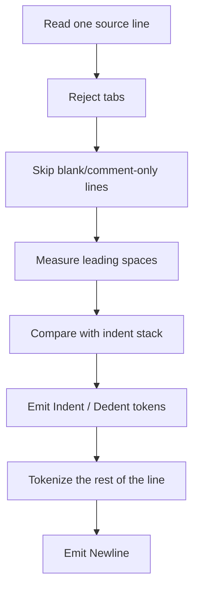

# Lexer

This chapter explains what a lexer is, what Aurora's lexer does, and how you could build a small Aurora-style lexer in Rust.

## What a lexer does

A lexer turns raw text into a sequence of tokens.

Example:

```aurora
return total + 1
```

becomes something like:

- `KwReturn`
- `Identifier("total")`
- `Plus`
- `IntLiteral(1)`
- `Newline`

The parser works on tokens because tokens are simpler and more regular than arbitrary text.

## Why Aurora's lexer matters

Aurora is indentation-sensitive, so its lexer does more than recognize words and punctuation.

Aurora's lexer in [`lexer.rs`](../crates/aurora-compiler/src/lexer.rs) is responsible for:

- rejecting tabs for indentation
- skipping blank lines and comment-only lines
- computing indentation depth per line
- emitting explicit `Indent` and `Dedent` tokens
- recognizing keywords, identifiers, numbers, strings, and f-strings
- recognizing duration suffixes such as `5ms`, `2s`, and `1m`
- preserving source locations with `Span`

That means the parser does not have to infer indentation itself. It just consumes block tokens.

## Aurora's lexing loop

At a high level, Aurora lexes line by line:



## Important token categories

Aurora's `TokenKind` includes:

- structural tokens
  `Newline`, `Indent`, `Dedent`, `Eof`
- punctuation
  parentheses, brackets, braces, `:`, `.`, `,`, `?`
- operators
  `=`, `==`, `!=`, `<`, `<=`, `+`, `+=`, and so on
- keywords
  `class`, `def`, `match`, `with`, `for`, `return`, and others
- literals
  integers, floats, durations, booleans, strings, f-strings

## Aurora-specific design choices

### 1. Indentation is explicit after lexing

The lexer keeps an `indent_stack`. When a new line is more indented, it emits `Indent`. When it is less indented, it emits one or more `Dedent` tokens.

That is the key to making an off-side language parse cleanly with a hand-written parser.

### 2. Comments are stripped early

Aurora treats `#` as the start of a comment when it appears outside strings. Comment-only lines do not produce tokens.

### 3. Duration literals are normalized at lex time

`5ms`, `2s`, and `1m` become `DurationLiteral(i128)` values in milliseconds. That keeps later stages simpler.

### 4. F-strings are lexed as one token first

Aurora stores the raw inside of an f-string as `FStringLiteral(String)`. The parser later splits it into literal and expression segments.

Ordinary strings use either matching single or double quote delimiters and
produce the same `StringLiteral(String)` token. While the lexer is collecting
an `f"..."` token, it tracks the active delimiter of any ordinary string inside
an interpolation. Braces inside either `'...'` or `"..."` therefore remain
string contents rather than changing interpolation depth.

`own` is a reserved keyword rather than a contextual identifier. The current
parser accepts it in the consuming receiver spelling `own self`; every stage
therefore sees one unambiguous ownership token.

## A tiny Aurora-like lexer in Rust

The real Aurora lexer is much richer than this, but this example shows the core idea: tokenize one line and emit a `Newline`.

```rust
#[derive(Debug, Clone, PartialEq)]
enum TokenKind {
    Identifier(String),
    IntLiteral(i64),
    KwReturn,
    Plus,
    Equal,
    Newline,
}

#[derive(Debug, Clone, PartialEq)]
struct Token {
    kind: TokenKind,
    line: usize,
    column: usize,
}

fn lex_line(line: &str, line_no: usize) -> Result<Vec<Token>, String> {
    let chars: Vec<(usize, char)> = line.char_indices().collect();
    let mut index = 0;
    let mut tokens = Vec::new();

    while index < chars.len() {
        let (offset, ch) = chars[index];
        let column = offset + 1;
        match ch {
            ' ' => index += 1,
            '+' => {
                tokens.push(Token { kind: TokenKind::Plus, line: line_no, column });
                index += 1;
            }
            '=' => {
                tokens.push(Token { kind: TokenKind::Equal, line: line_no, column });
                index += 1;
            }
            '0'..='9' => {
                let start = index;
                index += 1;
                while matches!(chars.get(index), Some((_, '0'..='9'))) {
                    index += 1;
                }
                let end = chars.get(index).map(|(i, _)| *i).unwrap_or(line.len());
                let text = &line[chars[start].0..end];
                let value = text.parse::<i64>().map_err(|_| "bad integer".to_string())?;
                tokens.push(Token {
                    kind: TokenKind::IntLiteral(value),
                    line: line_no,
                    column,
                });
            }
            '_' | 'a'..='z' | 'A'..='Z' => {
                let start = index;
                index += 1;
                while matches!(chars.get(index), Some((_, '_' | 'a'..='z' | 'A'..='Z' | '0'..='9'))) {
                    index += 1;
                }
                let end = chars.get(index).map(|(i, _)| *i).unwrap_or(line.len());
                let text = &line[chars[start].0..end];
                let kind = if text == "return" {
                    TokenKind::KwReturn
                } else {
                    TokenKind::Identifier(text.to_string())
                };
                tokens.push(Token { kind, line: line_no, column });
            }
            _ => return Err(format!("unexpected character `{}` at {}:{}", ch, line_no, column)),
        }
    }

    tokens.push(Token {
        kind: TokenKind::Newline,
        line: line_no,
        column: line.len() + 1,
    });
    Ok(tokens)
}
```

## How Aurora extends the tiny lexer

Aurora's real lexer adds:

- the full keyword set
- indentation tracking
- strings and f-strings
- floats and duration suffixes
- compound operators such as `+=` and `->`
- braces, brackets, dots, and question-mark optional syntax
- span-aware diagnostics

You can inspect those details in:

- [`lexer.rs`](../crates/aurora-compiler/src/lexer.rs)
- [`lexer_tests.rs`](../crates/aurora-compiler/src/lexer_tests.rs)

## Practical lessons from Aurora's lexer

- Keep indentation handling in the lexer, not the parser.
- Normalize obvious literal forms early when it simplifies later stages.
- Attach source locations to every token.
- Reject unsupported layout early and clearly.

## What comes next

Once Aurora has a token stream, the parser turns it into an AST. Read [04-parser.md](04-parser.md).
