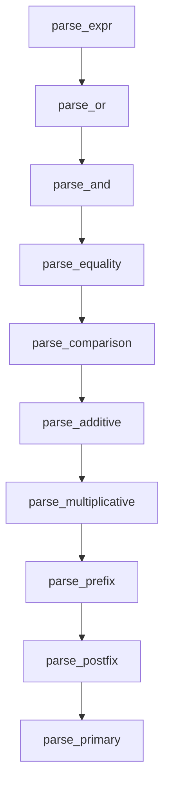

# Parser

This chapter explains what a parser is, how Aurora's parser works, and how to build a small Aurora-style recursive descent parser in Rust.

## What a parser does

A parser consumes tokens and builds syntax trees.

If the lexer says:

- `KwReturn`
- `Identifier("left")`
- `Plus`
- `Identifier("right")`

the parser decides that this means:

- a `return` statement
- whose value is a binary `+` expression
- whose left and right sides are both names

That is the parser's job: recovering structure from token order.

## Aurora uses a hand-written recursive descent parser

Aurora's parser is implemented in [`parser.rs`](../crates/aurora-compiler/src/parser.rs).

It is not generated from a parser generator. Instead, it uses ordinary Rust functions such as:

- `parse_module`
- `parse_item`
- `parse_stmt`
- `parse_type`
- `parse_expr`
- `parse_or`
- `parse_and`
- `parse_equality`
- `parse_comparison`
- `parse_additive`
- `parse_multiplicative`
- `parse_prefix`
- `parse_postfix`
- `parse_primary`

This style is especially readable when the language is still evolving quickly.

## Aurora's parsing strategy

Aurora combines three ideas:

- top-down recursive descent for declarations and statements
- precedence climbing by function layering for expressions
- explicit `Indent` / `Dedent` tokens for block structure

### Expression precedence in Aurora



This is a standard, clean way to encode precedence in a hand-written parser.

## What Aurora's parser has to recognize

Aurora's parser covers a large surface:

- imports
- classes, enums, functions, traits, impl blocks
- ordinary statements and top-level statements
- `if`, `match`, `for`, `while`, `with`
- expression-form `match`, including binding, argument, and nested block positions
- calls, named arguments, member access, indexing, specialization, casts
- borrowed parameters and borrowed returns
- patterns for `match`
- f-string interpolation parsing

It also keeps a recursion counter and enforces the conservative limit in [`limits.rs`](../crates/aurora-compiler/src/limits.rs).

## Why `Indent` and `Dedent` help so much

Without explicit block tokens, the parser would need to keep re-measuring whitespace from the raw source. Aurora avoids that by doing layout work once in the lexer.

So a function body parse is conceptually just:

1. expect `Indent`
2. parse statements until `Dedent`
3. expect `Dedent`

That is much simpler and more robust.

## A tiny Aurora-like parser in Rust

This example parses a tiny subset:

- integer literals
- names
- `+`
- `return`

```rust
#[derive(Debug, Clone)]
enum TokenKind {
    Identifier(String),
    IntLiteral(i64),
    KwReturn,
    Plus,
    Newline,
    Eof,
}

#[derive(Debug)]
enum Expr {
    Name(String),
    Int(i64),
    Binary {
        left: Box<Expr>,
        right: Box<Expr>,
    },
}

#[derive(Debug)]
enum Stmt {
    Return(Expr),
}

struct Parser {
    tokens: Vec<TokenKind>,
    index: usize,
}

impl Parser {
    fn current(&self) -> &TokenKind {
        &self.tokens[self.index]
    }

    fn bump(&mut self) -> TokenKind {
        let token = self.tokens[self.index].clone();
        self.index += 1;
        token
    }

    fn parse_stmt(&mut self) -> Result<Stmt, String> {
        match self.bump() {
            TokenKind::KwReturn => {
                let expr = self.parse_additive()?;
                self.expect_newline()?;
                Ok(Stmt::Return(expr))
            }
            other => Err(format!("unexpected statement start: {:?}", other)),
        }
    }

    fn parse_additive(&mut self) -> Result<Expr, String> {
        let mut expr = self.parse_primary()?;
        while matches!(self.current(), TokenKind::Plus) {
            self.bump();
            let right = self.parse_primary()?;
            expr = Expr::Binary {
                left: Box::new(expr),
                right: Box::new(right),
            };
        }
        Ok(expr)
    }

    fn parse_primary(&mut self) -> Result<Expr, String> {
        match self.bump() {
            TokenKind::Identifier(name) => Ok(Expr::Name(name)),
            TokenKind::IntLiteral(value) => Ok(Expr::Int(value)),
            other => Err(format!("unexpected token in expression: {:?}", other)),
        }
    }

    fn expect_newline(&mut self) -> Result<(), String> {
        match self.bump() {
            TokenKind::Newline | TokenKind::Eof => Ok(()),
            other => Err(format!("expected newline, found {:?}", other)),
        }
    }
}
```

That is the core parser pattern:

- use one function per grammar region
- keep token navigation simple
- structure precedence explicitly
- return syntax trees, not semantic answers

## How Aurora's real parser goes beyond the toy example

Aurora's real parser adds:

- module-level declaration parsing
- indentation-based block parsing
- optional type parameter lists and bounds
- borrowed receiver and parameter syntax
- pattern parsing for `match`
- postfix parsing for calls, member access, indexing, casts, and specialization
- f-string interpolation by recursively invoking expression parsing on the embedded text

## Aurora-specific parser details worth studying

### 1. `parse_stmt` vs `is_assignment_stmt`

Aurora allows both:

- expression statements
- assignment statements

Those can begin with similar tokens, so the parser uses lookahead logic in `is_assignment_stmt()` to decide whether it is parsing an assignment or an expression statement.

### 2. `parse_postfix`

Aurora treats many suffix forms uniformly:

- `value[index]`
- `value.field`
- `callee(...)`
- `expr as Type`
- `Name[T](...)`

That makes chained parsing like `pkg.Box[int32](value).field` much easier.

### 3. F-string parsing is split across lexer and parser

The lexer keeps the entire f-string as a literal token. The parser later splits it into `FormatPart::Literal` and `FormatPart::Expr`, and recursively parses the embedded expressions.

### 4. Explicit recursion limits

Aurora still uses real Rust recursion for several nested constructs, so the parser tracks recursion depth and fails with a diagnostic before the host stack blows up.

## How this connects to Aurora's checker

After parsing, Aurora has structure but not meaning.

The checker in `sema.rs` answers questions like:

- does this name exist?
- what type does this expression have?
- is this move legal?
- is this match exhaustive?
- are the imports valid?

Read [05-semantic-analysis.md](05-semantic-analysis.md) next.
