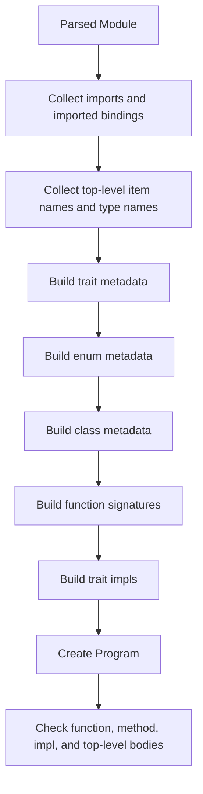

# Semantic Analysis

This chapter explains what semantic analysis is, what Aurora's checker does, and how to build a small Aurora-style type checker in Rust.

## What semantic analysis means

After parsing, you know the structure of the program, but not whether it makes sense.

Example:

```aurora
return left + right
```

The parser can build this AST just fine. It does not know:

- whether `left` exists
- whether `right` exists
- whether they have compatible types
- whether `return` is allowed here

Semantic analysis is the stage that answers those questions.

## Aurora's checked model: `Program`

Aurora's checker lives in [`sema.rs`](../crates/aurora-compiler/src/sema.rs). Its main output is `Program`.

`Program` contains:

- the original parsed `Module`
- module metadata such as `module_name` and `source_path`
- collected classes, enums, functions, traits, and trait impls
- imported module namespaces
- the module registry used for cross-module lookup
- the checked top-level statements

In other words, `Program` is Aurora's typed semantic world model for one module and the names it can see.

## What Aurora's checker actually does

Aurora's semantic analysis is not one check. It is a layered pass.



Aurora uses early collection phases so later checks can resolve forward references and cross-references.

## The main semantic data types

The most important checker data structures are:

| Type | Purpose |
| --- | --- |
| `Program` | The checked module plus semantic tables |
| `Type` | Aurora's lowered semantic type model |
| `ClassInfo` / `EnumInfo` / `FunctionInfo` / `TraitInfo` | Collected semantic metadata |
| `ModuleNamespace` | Exported/imported module surface |
| `FunctionChecker` | The body checker for functions, methods, impl methods, and top-level blocks |

## Aurora's semantic `Type`

Aurora lowers syntactic `TypeRef` values into semantic `Type` values:

- `Type::Named(String, Vec<Type>)`
- `Type::TypeParam(String)`
- `Type::Module(String)`
- `Type::Unit`

This is where names like `Option[int32]` stop being raw syntax and become a semantic type.

## Checks Aurora performs

Aurora's checker covers more than "basic type checking". It performs:

- duplicate item detection
- type-parameter validation and arity checks
- visibility-aware import validation
- recursive-field validation and `indirect` enforcement
- `copy class` validation
- function and method signature construction
- default argument validation
- trait declaration and impl validation
- return checking
- borrow-source validation for borrowed returns
- expression typing
- move analysis and use-after-move detection
- mutable borrow exclusivity checks
- `match` typing and pattern binding
- top-level-vs-`main` execution rules

## Ownership and borrowing are semantic, not syntactic

Aurora's syntax can say `borrow`, `borrow mut`, and borrowed return labels, but those words are only meaningful once the checker validates them.

Receiver syntax is normalized before body checking. Bare `self` and
`borrow self` both install a shared borrowed `self` binding. `own self`
installs an owned binding and consumes a non-copy receiver at the call
boundary. `borrow mut self` installs an exclusive mutable binding and requires
a mutable receiver place. Trait and implementation receiver matching compares
these resolved modes, so bare and explicit shared receivers are compatible
while an `own self` implementation cannot satisfy a shared receiver contract.

For Aurora 0.1, the checker permits borrowed-return calls only when the substituted result type is copyable. Those calls materialize copies. Non-copy borrowed-return declarations still receive provenance and trait-conformance checking, but calls are rejected before MIR lowering until Phase 6 supplies live alias storage.

Aurora's `FunctionChecker` tracks local bindings with information such as:

- semantic type
- whether the place is assignable
- whether it is a mutable place
- whether it came from a borrow
- whether it has been moved
- whether some fields have been partially moved

Places used by move, borrow, iteration-freeze, and mutable-match analysis have a canonical rooted representation: one binding root plus typed field projections. Relative projection paths are a separate type used only inside one binding's partial-move state. Keeping those types distinct prevents a relative field such as `state` from being compared accidentally with a rooted place such as `holder.state`.

That is why move and borrow diagnostics come from `sema.rs`, not the parser.

## A tiny Aurora-like type checker in Rust

This toy example checks three things:

- names must exist
- `+` only works on integers
- `return` must match the function return type

```rust
use std::collections::HashMap;

#[derive(Debug, Clone, PartialEq)]
enum Type {
    Int,
    Unit,
}

#[derive(Debug)]
enum Expr {
    Name(String),
    Int(i64),
    Add(Box<Expr>, Box<Expr>),
}

#[derive(Debug)]
enum Stmt {
    Return(Expr),
}

fn type_of_expr(expr: &Expr, locals: &HashMap<String, Type>) -> Result<Type, String> {
    match expr {
        Expr::Name(name) => locals
            .get(name)
            .cloned()
            .ok_or_else(|| format!("unknown name `{}`", name)),
        Expr::Int(_) => Ok(Type::Int),
        Expr::Add(left, right) => {
            let left_ty = type_of_expr(left, locals)?;
            let right_ty = type_of_expr(right, locals)?;
            if left_ty == Type::Int && right_ty == Type::Int {
                Ok(Type::Int)
            } else {
                Err("`+` expects two integers".to_string())
            }
        }
    }
}

fn check_block(body: &[Stmt], locals: &HashMap<String, Type>, return_type: &Type) -> Result<(), String> {
    for stmt in body {
        match stmt {
            Stmt::Return(expr) => {
                let actual = type_of_expr(expr, locals)?;
                if &actual != return_type {
                    return Err(format!(
                        "return type mismatch: expected {:?}, found {:?}",
                        return_type, actual
                    ));
                }
            }
        }
    }
    Ok(())
}
```

This is obviously much smaller than Aurora's real checker, but the pattern is the same:

- collect names into scopes
- walk statements and expressions
- assign semantic types
- emit diagnostics when meaning does not line up

## What makes Aurora's checker interesting

### 1. It builds semantic tables before checking bodies

Aurora can resolve many names because it first builds metadata tables for classes, enums, functions, traits, and impls.

### 2. It reuses call-binding logic

Named/positional argument binding is shared through [`call.rs`](../crates/aurora-compiler/src/call.rs), so function calls and builtin calls follow the same argument-shape rules.

### 3. It treats builtin modules as namespaces

`io`, `fs`, and `net` are represented as module namespaces through [`builtin_modules.rs`](../crates/aurora-compiler/src/builtin_modules.rs), which means import resolution and tooling can treat them similarly to ordinary modules.

### 4. It is the ownership gate

The checker is where Aurora enforces:

- non-copy moves
- move-after-use and use-after-move
- borrow exclusivity
- receiver consumption and mutable-receiver requirements
- borrow-return source constraints
- `with` resource requirements

### 5. It prepares later stages

MIR lowering does not want to rediscover the whole language's meaning. The checker gives it:

- resolved types
- validated control-flow surface
- validated trait and method shapes
- known module namespaces and imports

## Files to study after this chapter

- [`sema.rs`](../crates/aurora-compiler/src/sema.rs)
- [`call.rs`](../crates/aurora-compiler/src/call.rs)
- [`builtin_modules.rs`](../crates/aurora-compiler/src/builtin_modules.rs)
- [`sema_tests.rs`](../crates/aurora-compiler/src/sema_tests.rs)

## What comes next

After Aurora has a checked `Program`, it lowers that model into MIR. Read [06-mir.md](06-mir.md).
