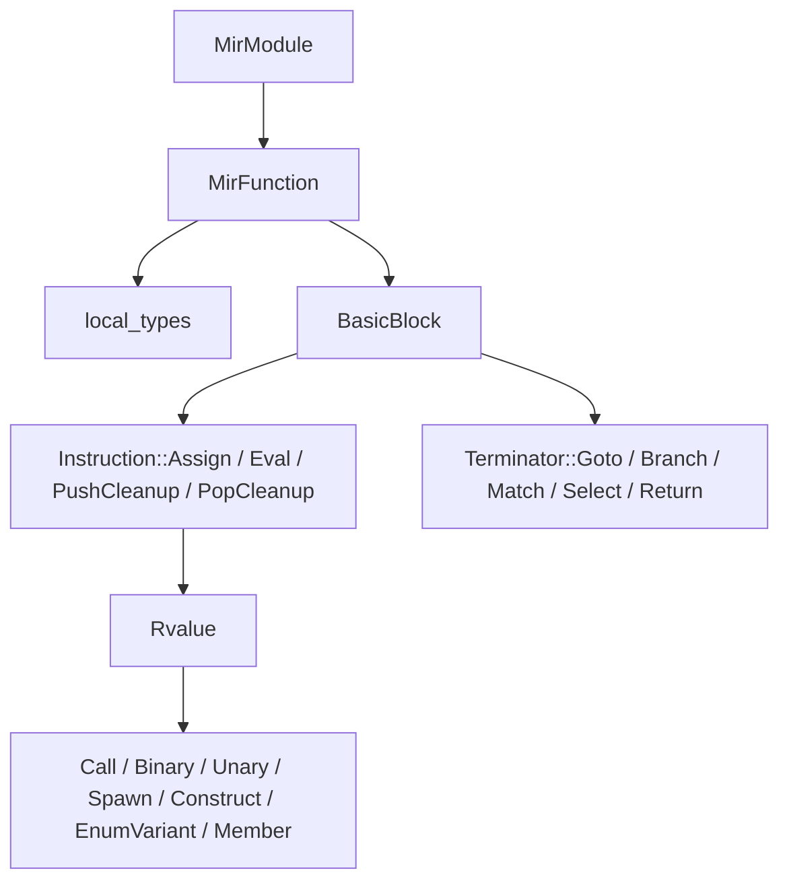

# MIR

This chapter explains what MIR is, why Aurora uses it, and how Aurora lowers checked programs into it.

## What MIR is

MIR stands for middle intermediate representation.

It sits between:

- the high-level checked program (`Program`)
- the concrete execution backends (MIR runtime and native codegen)

Aurora's MIR is defined in [`mir.rs`](../crates/aurora-compiler/src/mir.rs).

## Why Aurora does not execute the AST directly

The AST is good for representing source syntax. It is not ideal for execution or code generation because it still contains:

- many high-level syntactic forms
- expression nesting that is convenient for humans but awkward for runtimes
- block syntax rather than explicit control-flow edges

MIR solves that by turning checked programs into a more execution-shaped form.

## The main MIR data structures

Aurora's MIR centers around these types:

| Type | Purpose |
| --- | --- |
| `MirModule` | Whole lowered program: functions, classes, trait impls, optional top-level script |
| `MirFunction` | One function body with locals, entry block, and blocks |
| `BasicBlock` | Straight-line instructions plus a single terminator |
| `Instruction` | Assignment, evaluation, and cleanup-stack operations |
| `Rvalue` | Computation that produces a value |
| `Operand` | A place or literal already ready to use |
| `Terminator` | Control-flow transfer such as `Goto`, `Branch`, `Match`, `Select`, `Return` |

## Aurora's MIR shape



## What Aurora lowers into MIR

Aurora lowers:

- ordinary functions
- class methods
- trait impl methods
- imported public functions and methods
- top-level script bodies

That matters because both execution paths need a unified view of everything callable.

## How lowering works

Aurora's `lower(program: &Program) -> MirModule` does three high-level jobs:

1. create MIR functions for functions, methods, trait impl methods, and top-level statements
2. create MIR metadata for classes and trait impl dispatch
3. lower each checked body into blocks and instructions using `Lowerer`

## The `Lowerer`

`Lowerer` is Aurora's core MIR builder. It carries state such as:

- current block
- block counter and temp counter
- loop stack for `break` and `continue`
- return redirection state
- `with` cleanup stack
- local type information
- scoped names created while lowering patterns

This is where the AST stops looking like source code and starts looking like control flow.

## Example: `if` lowering

An `if` statement becomes explicit blocks:

- condition block
- then block
- else or next-condition block
- final merge block

That is much easier for both the MIR runtime and native codegen to execute.

## Example: `with` lowering

Aurora lowers `with` by explicitly managing cleanup instructions:

- assign the resource into the bound place
- `PushCleanup { place }`
- lower the body
- emit `PopCleanup` on normal exit
- unwind cleanup stack on `return`, `break`, `continue`, or exceptional early exits such as `try`

That is one of the most important architectural uses of MIR in Aurora: turning structured resource management into explicit runtime operations.

## A tiny MIR example in Rust

Here is a deliberately tiny MIR for integer addition:

```rust
#[derive(Debug)]
enum Operand {
    Place(String),
    Int(i64),
}

#[derive(Debug)]
enum Rvalue {
    Use(Operand),
    Add(Operand, Operand),
}

#[derive(Debug)]
enum Instruction {
    Assign { target: String, value: Rvalue },
}

#[derive(Debug)]
enum Terminator {
    Return(Operand),
}

#[derive(Debug)]
struct BasicBlock {
    instructions: Vec<Instruction>,
    terminator: Terminator,
}

fn lower_add_function() -> BasicBlock {
    BasicBlock {
        instructions: vec![Instruction::Assign {
            target: "tmp0".to_string(),
            value: Rvalue::Add(
                Operand::Place("left".to_string()),
                Operand::Place("right".to_string()),
            ),
        }],
        terminator: Terminator::Return(Operand::Place("tmp0".to_string())),
    }
}
```

That example is much smaller than Aurora's real MIR, but it captures the idea:

- complex expressions become named temporaries
- work happens in straight-line instructions
- control flow is explicit at block boundaries

## Aurora-specific MIR features

Aurora's real MIR goes well beyond the toy example. It includes:

- `Try`
  `Result` propagation at the IR level
- `Construct`
  class-instance construction
- `EnumVariant` and `VariantPayload`
  enum creation and payload extraction
- `CallTarget::Member`
  method and member-call lowering with receiver-place writeback support, including `TaskGroup.start(...)` and `TaskGroup.start_soon(...)`
- builtin call lowering for `wait_any(...)` and `wait_all(...)`
  scheduler-backed task waiting through ordinary MIR call paths
- `ForRange`
  a specialized loop terminator for range iteration
- cleanup instructions
  explicit `PushCleanup` and `PopCleanup`

## Why both backends benefit from MIR

Aurora uses the same MIR for:

- `mir_runtime.rs`
- `native_codegen.rs`

That gives the project a strong architectural advantage:

- the runtime and codegen reason about one shared IR
- tests can validate lowering once and reuse it across execution paths
- new language features can first gain MIR support and then reuse that support in multiple backends

## Files worth studying

- [`mir.rs`](../crates/aurora-compiler/src/mir.rs)
- [`mir_tests.rs`](../crates/aurora-compiler/src/mir_tests.rs)
- [`mir_runtime.rs`](../crates/aurora-compiler/src/mir_runtime.rs)
- [`native_codegen.rs`](../crates/aurora-compiler/src/native_codegen.rs)

## What comes next

Read [07-mir-runtime.md](07-mir-runtime.md) to see how Aurora executes MIR directly.
