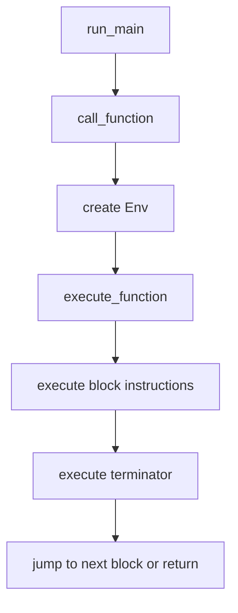
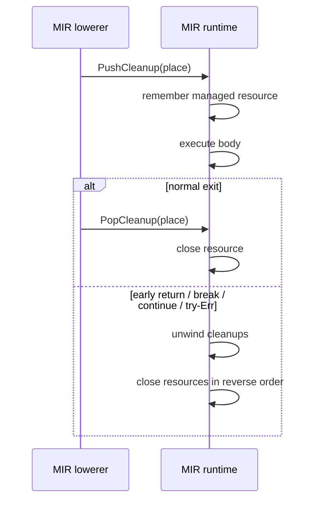

# MIR Runtime

This chapter explains how Aurora executes MIR directly.

## What a runtime does

A runtime is the part of a language implementation that actually performs the program's work:

- evaluating expressions
- calling functions
- allocating and updating values
- handling control flow
- interacting with the host environment

Aurora's MIR runtime lives in [`mir_runtime.rs`](../crates/aurora-compiler/src/mir_runtime.rs). It executes the MIR produced by [`mir.rs`](../crates/aurora-compiler/src/mir.rs).

## Aurora's maintained `run` architecture

Today, `aura run` works like this:

1. parse and check the program
2. lower it to MIR
3. call `mir_runtime::run(&mir)`
4. execute the resulting value graph and host resource operations

The MIR runtime is not a toy leftover. It is one of the main maintained execution engines.

## Runtime layering

The MIR runtime uses the shared runtime value layer in [`runtime_value.rs`](../crates/aurora-compiler/src/runtime_value.rs).


That split is important:

- `mir_runtime.rs` knows how to execute MIR
- `runtime_value.rs` knows how Aurora values and resources behave

## The main runtime objects

Aurora's MIR runtime centers around:

| Type | Purpose |
| --- | --- |
| `MirRuntime` | The execution engine |
| `Env` | The runtime environment for one function call |
| `RunOutput` | Final return value plus captured stdout |
| `CallOutcome` | Function result plus mutable receiver/parameter writebacks |
| `Value` | Concrete runtime values defined in `runtime_value.rs` |

## How execution starts

`run(module)` does not execute directly on the caller's thread. It starts a dedicated runtime thread with a large stack:

- Aurora supports real recursion
- several runtime operations are stack-heavy enough to justify a larger stack budget
- runtime panics are caught and translated into diagnostics

That is why `run` wraps execution in a thread builder instead of just calling a function directly.

## The core execution loop

At a high level, Aurora executes MIR like this:



Inside a function call, the runtime:

- binds arguments to parameters
- infers or applies concrete runtime types for generic positions
- seeds the environment with locals and parameter values
- walks blocks starting from the entry label
- updates a cleanup stack for `with`
- returns a `Value`

## `Env`: Aurora's local state for one call

`Env` stores:

- `values`
  the current values of MIR places
- `types`
  the current known type of each place

It supports:

- `read_place`
  including nested field paths such as `self.field`
- `write_place`
  including nested field updates

This is how MIR place strings become actual mutable runtime storage.

## How Aurora evaluates MIR operations

### Instructions

Aurora's instruction set is small:

- `Assign`
- `Eval`
- `PushCleanup`
- `PopCleanup`

### Terminators

Aurora's terminators drive control flow:

- `Return`
- `Goto`
- `Branch`
- `ForRange`
- `Match`
- `Select`

### Rvalues

Most interesting computation happens in `evaluate_rvalue`, which handles:

- unary and binary operators
- calls and method calls
- casts
- `try`
- `TaskGroup.start(...)` and `TaskGroup.start_soon(...)`
- `wait_any(...)` and `wait_all(...)`
- vector/set/map literals
- class construction
- enum construction and payload extraction

## Resource cleanup is explicit

Aurora's `with` semantics are implemented through a cleanup stack.



This is one of the big reasons Aurora lowers to MIR: structured cleanup becomes a concrete runtime protocol.

## Concurrency in the MIR runtime

Aurora's MIR runtime supports:

- queues
- tasks
- task groups
- `TaskGroup.start(...)`
- `TaskGroup.start_soon(...)`
- `wait_any(...)`
- `wait_all(...)`
- cancellation propagation

Important details:

- task-group children run on scheduler-backed host threads with shared cancellation state
- task groups provide child cancellation scopes
- `wait_any(...)` and `wait_all(...)` reuse the shared runtime scheduler deadline helpers
- `Queue.get(timeout=...)` and I/O methods use deadline-aware helpers

## Networking and I/O

The MIR runtime delegates I/O and networking behavior to resource types in `runtime_value.rs`:

- `FileValue`
- `TcpListenerValue`
- `TcpStreamValue`
- `UdpSocketValue`
- `HttpListenerValue`
- `HttpExchangeValue`
- `WebSocketValue`
- `Unix*` and `Tls*` values

Those types wrap host resources and expose Aurora-level methods such as:

- `read_all`
- `write_all`
- `accept`
- `recv`
- `respond_text`
- `send_bytes`

## A tiny interpreter in Rust

This example shows the core idea of an interpreter loop for a very small MIR-like IR.

```rust
use std::collections::HashMap;

#[derive(Clone, Debug)]
enum Value {
    Int(i64),
}

#[derive(Clone, Debug)]
enum Operand {
    Place(String),
    Int(i64),
}

#[derive(Clone, Debug)]
enum Instruction {
    Add { target: String, left: Operand, right: Operand },
}

#[derive(Clone, Debug)]
enum Terminator {
    Return(Operand),
}

#[derive(Clone, Debug)]
struct Block {
    instructions: Vec<Instruction>,
    terminator: Terminator,
}

fn eval_operand(op: &Operand, env: &HashMap<String, Value>) -> Value {
    match op {
        Operand::Place(name) => env.get(name).cloned().unwrap(),
        Operand::Int(value) => Value::Int(*value),
    }
}

fn run_block(block: &Block, env: &mut HashMap<String, Value>) -> Value {
    for instruction in &block.instructions {
        match instruction {
            Instruction::Add { target, left, right } => {
                let Value::Int(left) = eval_operand(left, env);
                let Value::Int(right) = eval_operand(right, env);
                env.insert(target.clone(), Value::Int(left + right));
            }
        }
    }

    match &block.terminator {
        Terminator::Return(op) => eval_operand(op, env),
    }
}
```

Aurora's real runtime is larger because it handles:

- multiple blocks and jumps
- many value kinds
- method dispatch
- mutable receiver writebacks
- cleanup unwinding
- concurrency and I/O

But the tiny example shows the same basic interpreter pattern.

## Files to study

- [`mir_runtime.rs`](../crates/aurora-compiler/src/mir_runtime.rs)
- [`runtime_value.rs`](../crates/aurora-compiler/src/runtime_value.rs)
- [`mir_runtime_tests.rs`](../crates/aurora-compiler/src/mir_runtime_tests.rs)

## What comes next

Read [08-native-codegen-and-runtime.md](08-native-codegen-and-runtime.md) to see how Aurora turns the same MIR into native machine code.
