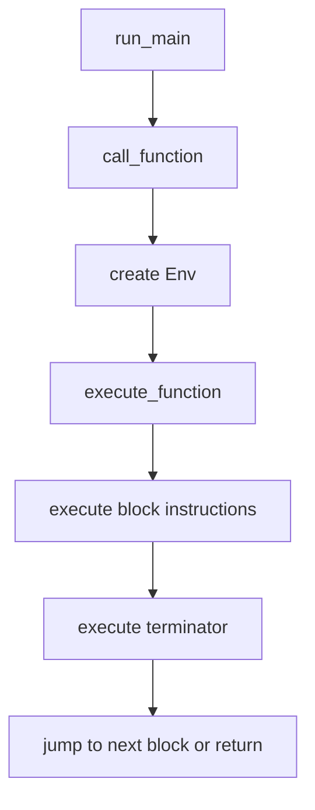
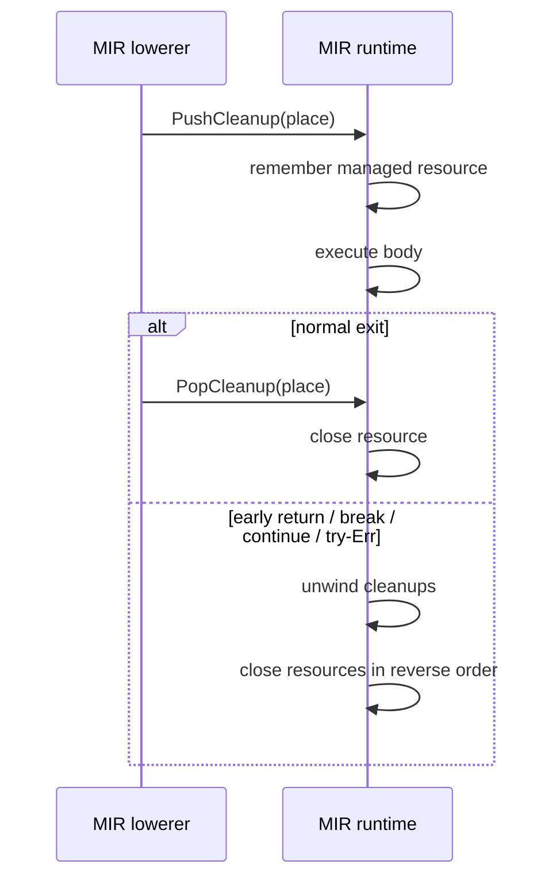

# MIR Runtime

This chapter explains how Aurora executes MIR directly.

## What a runtime does

A runtime is the part of a language implementation that actually performs the program's work:

- evaluating expressions
- calling functions
- allocating and updating values
- handling control flow
- interacting with the host environment

Aurora's MIR runtime lives in [`mir_runtime.rs`](../crates/aurora-compiler/src/mir_runtime.rs). It executes the MIR produced by [`mir.rs`](../crates/aurora-compiler/src/mir.rs).

## Aurora's maintained `run` architecture

Today, `aura run` works like this:

1. parse and check the program
2. lower it to MIR
3. call `mir_runtime::run(&mir)`
4. execute the resulting value graph and host resource operations

The MIR runtime is not a toy leftover. It is one of the main maintained execution engines.

## Runtime layering

The MIR runtime uses the shared runtime value layer in [`runtime_value.rs`](../crates/aurora-compiler/src/runtime_value.rs).


That split is important:

- `mir_runtime.rs` knows how to execute MIR
- `runtime_value.rs` knows how Aurora values and resources behave

## The main runtime objects

Aurora's MIR runtime centers around:

| Type | Purpose |
| --- | --- |
| `MirRuntime` | The execution engine |
| `Env` | The runtime environment for one function call |
| `RunOutput` | Final return value plus captured stdout |
| `CallOutcome` | Function result plus mutable receiver/parameter writebacks |
| `Value` | Concrete runtime values defined in `runtime_value.rs` |

Each MIR function also carries its owning source path. When execution traps,
the runtime snapshots `RuntimeCallFrame` records innermost first and
`RuntimeTaskFrame` records youngest first into the compiler diagnostic before
cleanup changes the active environment or task context. An explicit captured
marker makes that operation once-only even when both arrays are legitimately
empty.

## How execution starts

`run(module)` does not execute directly on the caller's thread. It starts a dedicated runtime thread with a large stack:

- Aurora supports real recursion
- several runtime operations are stack-heavy enough to justify a larger stack budget
- runtime panics are caught and translated into diagnostics

That is why `run` wraps execution in a thread builder instead of just calling a function directly.

This dedicated entry thread reserves a 64 MiB host stack. Aurora task bodies
execute as stackful coroutines on the pinned-worker scheduler. The worker
count defaults to the available parallelism reported by the host, and a child
remains on its
spawn-time worker. Lightweight tasks use a guarded 512 KiB default stack.
`TaskGroup.start_with_stack` and `start_soon_with_stack` can select a guarded
stack from 256 KiB through 64 MiB for an individual child.

Dedicated process-lifetime services keep blocking and stack-heavy host work off
the coroutine stacks: the blocking-I/O pool owns ordinary blocking calls, the
protocol service owns TLS/HTTP/WebSocket steps, and the JSON codec service owns
the recursive parser frames for dynamic `json.parse`. The legacy
`json.is_valid` and `json.parse_string_map` compatibility helpers remain
bounded caller-side operations and do not enter that service. These services
resume the pinned coroutine after completion; they do not execute Aurora task
bodies and are distinct from the pinned-worker task-execution parallelism.

## The core execution loop

At a high level, Aurora executes MIR like this:



Inside a function call, the runtime:

- binds arguments to parameters
- infers or applies concrete runtime types for generic positions
- seeds the environment with locals and parameter values
- walks blocks starting from the entry label
- updates a cleanup stack for `with`
- returns a `Value`

## `Env`: Aurora's local state for one call

`Env` stores:

- `values`
  the current values of MIR places
- `types`
  the current known type of each place

It supports:

- `read_place`
  including nested field paths such as `self.field`
- `write_place`
  including nested field updates

This is how MIR place strings become actual mutable runtime storage.

## How Aurora evaluates MIR operations

### Instructions

Aurora's instruction set is small:

- `Assign`
- `Eval`
- `PushCleanup`
- `PopCleanup`

### Terminators

Aurora's terminators drive control flow:

- `Return`
- `Goto`
- `Branch`
- `ForRange`
- `Match`
- `Select`

### Rvalues

Most interesting computation happens in `evaluate_rvalue`, which handles:

- unary and binary operators
- calls and method calls
- casts
- `try`
- `TaskGroup.start(...)` and `TaskGroup.start_soon(...)`
- `wait_any(...)` and `wait_all(...)`
- vector/set/map literals
- class construction
- enum construction and payload extraction

## Resource cleanup is explicit

Aurora's `with` semantics are implemented through a cleanup stack.



This is one of the big reasons Aurora lowers to MIR: structured cleanup becomes a concrete runtime protocol.

## Concurrency in the MIR runtime

Aurora's MIR runtime supports:

- queues
- tasks
- task groups
- `TaskGroup.start(...)`
- `TaskGroup.start_soon(...)`
- `wait_any(...)`
- `wait_all(...)`
- cancellation propagation

Important details:

- task-group children run as stackful coroutines on stable spawn-time workers,
  with per-task cancellation state
- task groups provide child cancellation scopes
- `wait_any(...)` and `wait_all(...)` reuse the shared runtime scheduler deadline helpers
- `Queue.get(timeout=...)` and I/O methods use deadline-aware helpers
- compiler-inserted loop-backedge safepoints eventually yield from a hot loop
  to runnable work on the local worker, but one long iteration or straight-line
  CPU region can still starve siblings pinned there
- descriptor registrations persist in the reactor, deadlines live in a timer
  heap, and Queue, task-completion, and worker-pool events notify the
  responsible worker directly

### Scheduler ownership and nested starts

The scheduler driver is the sole mutable owner of
`LightweightTaskScheduler`. A running coroutine does not keep a pointer or
reference to that scheduler. When a running task starts a child, it first
allocates the guarded coroutine stack and `TaskState`; failure is synchronous,
returns no handle, and enqueues nothing. A successful start places an owned
prepared-task request into a scheduler-owned broker. The driver drains that
broker after each coroutine resume, after forced cleanup or Rust unwinding, and
repeatedly while tearing the scheduler down.

The broker is FIFO so admission is deterministic inside the current runtime
implementation. That is not a public ready-task or execution-order guarantee:
reactor events, yields, and other wakeups can interleave, and Aurora leaves
scheduling order unspecified.

Task-local context uses reference-counted ownership and is cloned out of its
thread-local slot before callbacks or suspension. No `RefCell` borrow and no
borrow of the scheduler crosses a coroutine yield. Whether a lightweight task
is armed in an unbounded wait is stored on its shared `TaskState`, so group
cleanup can inspect it without reaching into the scheduler.

If the scheduler itself is torn down, it disarms registered waits, drains
prepared starts, and retires every remaining task as cancelled so handles and
waiters are notified. MIR and other pure-Rust task closures are force-unwound,
which drops their Rust-owned captures. A started direct-native task cannot
safely unwind through generated Cranelift frames; its stack is reset and its
scheduler-owned host/runtime state is released instead. An unstarted direct
task drops its entry closure and external state once. The scheduler invokes
forced cleanup and Rust destructors with the task context installed, so any
child start they perform enters the same broker and is drained before teardown
completes. Scheduler-owned containment callbacks are non-panicking host
cleanup; a panic would interrupt retirement of the remaining task records and
is forbidden by their internal safety contract.

Phase 5.7 hosts this scheduler state on N pinned workers. N defaults to the
available parallelism reported by the host; the provisional
`AURORA_WORKERS=<positive integer>` environment override selects an explicit
count. A child is assigned when admitted at spawn time and keeps that worker
for its lifetime. Its coroutine stack never migrates and no worker steals
another worker's ready tasks. Consequently `yield_now()` requeues only on the
current worker.

Queue and Task handle internals provide the synchronized cross-worker
notification and observation paths. Accepted ADR-0033 supplies the
share-nothing boundary for everything else: captures and results cross only as
owned `Transfer` values, while live host authority and capability views remain
on their owning task. Current-task cancellation and diagnostic context are
installed and restored per task, so activity on one worker cannot borrow or
replace another worker's ambient task state.

MIR and direct-native tasks use the same pinned-worker contract. Ready-task
order, independent completion order, and emitted-output order remain
unspecified. The runtime exposes no worker identity or affinity control and
makes no promise of preemption, migration, work stealing, or workload-wide
parallel speedup; the multicore claim is limited to admitted Aurora task
execution.

## Networking and I/O

The MIR runtime delegates I/O and networking behavior to resource types in `runtime_value.rs`:

- `FileValue`
- `TcpListenerValue`
- `TcpStreamValue`
- `UdpSocketValue`
- `HttpListenerValue`
- `HttpExchangeValue`
- `WebSocketValue`
- `Unix*` and `Tls*` values

Those types wrap host resources and expose Aurora-level methods such as:

- `read_all`
- `write_all`
- `accept`
- `recv`
- `respond_text`
- `send_bytes`

### Configurable blocking-I/O service

Host operations that can block are submitted to one process-wide, lazily
initialized blocking-I/O pool. `AURORA_BLOCKING_WORKERS=<positive integer>`
selects its exact worker count without clamping. When absent, available host
parallelism is used, with fallback `4`, and that derived default is clamped to
`2..=8`. `AURORA_BLOCKING_QUEUE_CAPACITY=<positive integer>` bounds accepted
jobs waiting in the FIFO queue; it counts pending jobs only, not running jobs
or callers still waiting for admission. Omitting it preserves the compatible
unbounded queue.

A full bounded queue uses FIFO, scheduler-aware admission. A lightweight task
parks without blocking its pinned worker; a non-task host caller may block its
calling thread. Before insertion into the pending queue, cancellation or
deadline expiry removes the admission waiter and prevents the host operation
from running. Insertion is the acceptance boundary: an accepted pending or
running operation executes exactly once even if the Aurora wait later ends,
and its late result is discarded.

Both settings are validated before user code under MIR, direct execution, and
standalone native launch. The first runtime preflight reads them once, and the
resulting configuration is immutable for the process lifetime. Empty, zero,
signed, whitespace-padded, non-decimal, or overflowing values fail with
`AU4006`. Valid preflight creates no blocking-pool worker threads. First
submission creates the complete worker set, which is reused until process exit;
production has no Aurora shutdown or join surface for this pool. A
worker-creation failure is also `AU4006` and never degrades silently to a
smaller or synchronous pool.

Bounding accepted pending work prevents an unlimited accepted queue backlog;
admission waiters remain outside that capacity. The bound cannot interrupt
accepted host calls or guarantee unrelated blocking-I/O work will start while
every worker remains stuck. FIFO specifies pending dequeue and admission order,
not completion order.

## A tiny interpreter in Rust

This example shows the core idea of an interpreter loop for a very small MIR-like IR.

```rust
use std::collections::HashMap;

#[derive(Clone, Debug)]
enum Value {
    Int(i64),
}

#[derive(Clone, Debug)]
enum Operand {
    Place(String),
    Int(i64),
}

#[derive(Clone, Debug)]
enum Instruction {
    Add { target: String, left: Operand, right: Operand },
}

#[derive(Clone, Debug)]
enum Terminator {
    Return(Operand),
}

#[derive(Clone, Debug)]
struct Block {
    instructions: Vec<Instruction>,
    terminator: Terminator,
}

fn eval_operand(op: &Operand, env: &HashMap<String, Value>) -> Value {
    match op {
        Operand::Place(name) => env.get(name).cloned().unwrap(),
        Operand::Int(value) => Value::Int(*value),
    }
}

fn run_block(block: &Block, env: &mut HashMap<String, Value>) -> Value {
    for instruction in &block.instructions {
        match instruction {
            Instruction::Add { target, left, right } => {
                let Value::Int(left) = eval_operand(left, env);
                let Value::Int(right) = eval_operand(right, env);
                env.insert(target.clone(), Value::Int(left + right));
            }
        }
    }

    match &block.terminator {
        Terminator::Return(op) => eval_operand(op, env),
    }
}
```

Aurora's real runtime is larger because it handles:

- multiple blocks and jumps
- many value kinds
- method dispatch
- mutable receiver writebacks
- cleanup unwinding
- concurrency and I/O

But the tiny example shows the same basic interpreter pattern.

## Files to study

- [`mir_runtime.rs`](../crates/aurora-compiler/src/mir_runtime.rs)
- [`runtime_value.rs`](../crates/aurora-compiler/src/runtime_value.rs)
- [`mir_runtime_tests.rs`](../crates/aurora-compiler/src/mir_runtime_tests.rs)

## What comes next

Read [08-native-codegen-and-runtime.md](08-native-codegen-and-runtime.md) to see how Aurora turns the same MIR into native machine code.
