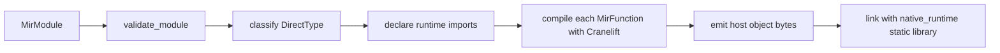

# Native Codegen And Runtime

This chapter explains Aurora's direct native backend and the runtime ABI it targets.

## What code generation is

Code generation is the stage that turns an intermediate representation into machine-level artifacts.

In Aurora, the direct backend:

- takes `MirModule`
- uses Cranelift to emit native code into an object file
- links that object file against Aurora's direct runtime

The code generator lives in [`native_codegen.rs`](../crates/aurora-compiler/src/native_codegen.rs). The runtime ABI it targets lives in [`native_runtime.rs`](../crates/aurora-compiler/src/native_runtime.rs).

## Aurora's two native build modes

From the CLI's perspective:

- `--backend direct`
  always uses the direct backend
- `--backend auto`
  tries direct first, then falls back to a MIR-runtime launcher binary if direct fails

That behavior is implemented in [`crates/aura/src/main.rs`](../crates/aura/src/main.rs).

## The direct backend pipeline



## Aurora's type strategy for native codegen

Aurora does not lower every value the same way.

`native_codegen.rs` classifies values into:

- `DirectType::Scalar`
  simple scalar values such as integers, floats, bool, and unit
- `DirectType::PlainClass`
  classes that can be passed directly as flattened fields
- `DirectType::Opaque`
  rich values that are boxed and passed through runtime pointers

This is one of the most important design choices in Aurora's native backend.

### Why this matters

It lets Aurora avoid boxing everything while still supporting rich language features.

- simple data can stay cheap
- complex data can still reuse runtime semantics
- the code generator does not need bespoke low-level handling for every value form

## Runtime imports instead of inlined complexity

Aurora's native codegen does not implement every builtin directly in generated machine code.

Instead, it declares many runtime functions such as:

- string helpers
- vector/map/set helpers
- queue/task helpers
- file/network helpers
- enum and instance helpers
- boxing/unboxing helpers

That keeps code generation smaller and keeps runtime semantics centralized.

## The role of `native_runtime.rs`

The direct runtime is Aurora's native ABI layer. It is responsible for:

- hosting boxed `OpaqueValue` objects
- explicit refcount management
- numeric operation helpers
- string and collection helpers
- queue/task operations
- direct file and networking builtins
- runtime diagnostics with source context
- once-only typed call-frame and task-ancestry capture

Aurora uses explicit retain/release helpers because generated code may pass opaque pointers around independently of Rust's normal ownership system.

Generated functions publish static frame metadata and push/pop native call
records around Aurora calls. Direct task state also owns the task-entry and
parent-spawn records needed to reconstruct ancestry. A trap captures both
lists before generated cleanup or forced stack reset, using the same
compiler-owned diagnostic types and ordering as the MIR runtime.

## `OpaqueValue` and refcounting

`native_runtime.rs` defines:

- `OpaqueValue`
  the heap box holding a `Value`
- `retain_ref_count`
- `release_ref_count`

The key idea is:

- generated native code can cheaply pass opaque values as pointer-sized handles
- the runtime preserves Aurora semantics by storing real `Value` data behind those handles

## A tiny direct-backend design example

This miniature example does not use Cranelift, but it shows the same architectural split: simple values are direct, complex values are boxed.

```rust
#[derive(Debug, Clone)]
enum Type {
    Int,
    Bool,
    Vec,
}

#[derive(Debug, Clone)]
enum DirectType {
    Scalar,
    Opaque,
}

fn classify(ty: &Type) -> DirectType {
    match ty {
        Type::Int | Type::Bool => DirectType::Scalar,
        Type::Vec => DirectType::Opaque,
    }
}

fn emit_add(left: DirectType, right: DirectType) -> Result<&'static str, String> {
    match (left, right) {
        (DirectType::Scalar, DirectType::Scalar) => Ok("emit native integer add"),
        _ => Err("route through runtime helper instead".to_string()),
    }
}
```

Aurora's real backend is more advanced, but the design lesson is the same:

- classify values
- emit fast paths for simple cases
- call runtime helpers for rich behavior

## Cranelift's role

Aurora uses Cranelift to:

- create function signatures
- build IR blocks and instructions
- manage variables and values
- emit object code for the host ISA

Aurora still does the language-specific work itself:

- mapping MIR semantics onto Cranelift operations
- deciding when to box or flatten
- selecting runtime helpers
- validating that the MIR shape is supported by the direct backend

## Validation before emission

Before codegen, Aurora validates the MIR module and functions. That protects the backend from malformed or unsupported input shapes.

This is good compiler engineering:

- reject impossible or unsafe IR early
- keep codegen assumptions explicit
- fail with diagnostics instead of generating nonsense

## How the direct runtime relates to the MIR runtime

The direct runtime and the MIR runtime are different execution engines, but they are designed to preserve the same language behavior.

They both depend on the same language-level concepts:

- `Value`
- class and enum semantics
- collection behavior
- task/queue behavior
- file and networking behavior
- numeric overflow and division diagnostics

They also produce the same complete structured diagnostics. Native execution
does not reconstruct frames from human stderr: when launched by `aura` on a
maintained Unix host, the runtime can write one bounded JSON diagnostic to a
private inherited file descriptor. The channel is used only for Aurora traps;
ordinary nonzero program returns leave it empty. A successful structured write
suppresses duplicate human stderr, while a failed write retains the human
diagnostic.

## Generated task exit and scheduler teardown

Generated direct tasks suspend below Cranelift frames. Rust unwinding cannot
safely cross those frames on every supported platform, so the scheduler never
pretends that a forced reset is an ordinary unwind.

On normal return, direct task scope guards release the task's runtime state in
the usual way. A runtime trap or cooperative cancellation first uses the
direct-runtime boundary to run the language cleanup stack that the generated
program registered. The scheduler then resets the generated coroutine stack
and runs an exact-once containment callback. That callback releases the
argument buffer, its claim flag, tracked opaque-value references, and remaining
task-local direct-runtime state.

Scheduler teardown also covers both admission states. An unstarted prepared
direct task drops its entry closure and releases its external state exactly
once. A started but suspended direct task resets its generated stack and uses
the same containment callback. Direct root tasks use the forced-exit runner as
well, so a trapped, cancelled, or internally abandoned root cannot leave its
task-local ownership ledger behind.

This fallback is for host/runtime containment only. Once the generated stack
has been reset, it must not invoke arbitrary Aurora cleanup thunks. Ordinary
source-level cleanup remains the responsibility of generated control flow and
the direct-runtime error boundary before forced exit; scheduler abandonment is
not a second language-level cleanup mechanism.

## Files to study

- [`native_codegen.rs`](../crates/aurora-compiler/src/native_codegen.rs)
- [`native_runtime.rs`](../crates/aurora-compiler/src/native_runtime.rs)
- [`native_codegen_tests.rs`](../crates/aurora-compiler/src/native_codegen_tests.rs)
- [`native_runtime_tests.rs`](../crates/aurora-compiler/src/native_runtime_tests.rs)

## What comes next

Read [09-packages-and-module-loading.md](09-packages-and-module-loading.md) to see how Aurora finds modules, packages, workspaces, and dependencies before any of the execution paths run.
