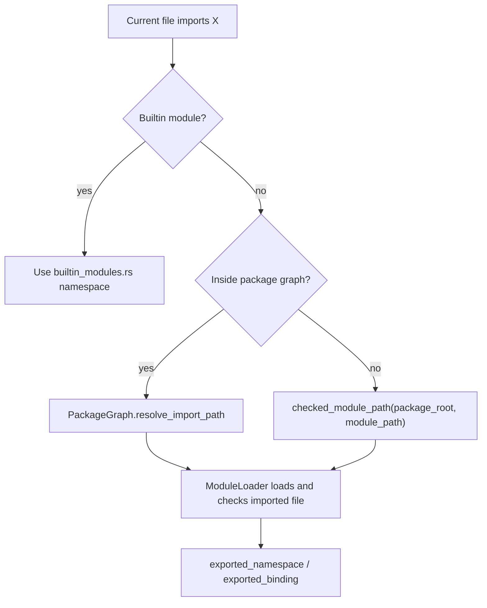

# Packages And Module Loading

This chapter explains how Aurora resolves imports, packages, workspaces, and dependencies.

## Why this layer exists

Real languages do not compile single files in isolation forever. They need a way to answer:

- what file does `import helpers.math` mean?
- what counts as the package root?
- how do local path dependencies work?
- how are git dependencies pinned?
- how do editor buffers resolve imports without being saved as the final file yet?

Aurora handles that through two cooperating pieces:

- `ModuleLoader` in [`lib.rs`](../crates/aurora-compiler/src/lib.rs)
- `PackageGraph` and related helpers in [`package.rs`](../crates/aurora-compiler/src/package.rs)

## The responsibilities are split on purpose

### `ModuleLoader`

`ModuleLoader` is the compiler-facing import resolver. It:

- loads source files
- parses and checks imported modules
- caches already-loaded programs
- detects cyclic imports
- resolves builtin vs user imports
- builds the module registry passed into semantic analysis

### `PackageGraph`

`PackageGraph` is the package/dependency model. It:

- discovers the enclosing package or workspace
- loads `Aurora.toml`
- loads `Aurora.lock`
- resolves path dependencies
- resolves git dependencies and materializes checkouts
- maps file paths to logical module names

## Import resolution flow



## Builtin modules look like modules on purpose

Aurora's builtin namespaces `io`, `fs`, and `net` are modeled through [`builtin_modules.rs`](../crates/aurora-compiler/src/builtin_modules.rs).

That means:

- import logic can treat them similarly to user modules
- semantic analysis can resolve them through namespace structures
- tooling can expose them consistently

This is a strong architectural choice because it prevents builtin behavior from becoming scattered special cases.

## How Aurora discovers package context

When checking a path, Aurora first tries to discover whether that file lives inside an Aurora package or workspace.

Important concepts:

- `Aurora.toml`
  package or workspace manifest
- `Aurora.lock`
  dependency resolution state
- `src/`
  package source root
- workspace members
  packages listed in a workspace manifest

If no package manifest applies, Aurora falls back to a looser file-based module root inference.

## Git dependencies

Aurora's package layer supports git dependencies with:

- `rev`
- `tag`
- `branch`

Notable implementation details:

- revisions and selectors are validated
- interactive git credential prompts are disabled
- checkout cache paths are hashed from the source URL/path
- cached trees are checked for hostile symlinks
- resolved revisions are written into `Aurora.lock`

This is more than convenience. It is part of the repo's hardening story.

## Export qualification

When Aurora exports types and items from imported modules, it qualifies their names so later consumers can distinguish:

- local items
- imported items
- builtin items

That is why export helpers in `lib.rs` rewrite some type and declaration shapes with fully qualified module paths.

## A tiny module resolver in Rust

This example shows the idea of resolving a module path into a source file path.

```rust
use std::path::{Path, PathBuf};

fn resolve_import_path(package_root: &Path, module_path: &[&str]) -> Result<PathBuf, String> {
    let mut path = package_root.join("src");
    for segment in module_path {
        path.push(segment);
    }
    path.set_extension("au");

    if path.exists() {
        Ok(path)
    } else {
        Err(format!("cannot resolve module at {}", path.display()))
    }
}
```

Aurora's real implementation is more careful because it also needs to:

- protect against path escape
- support package graphs and dependency aliases
- support workspaces
- support git checkouts
- preserve logical module names

## Why this stage matters to tooling too

Import resolution is not only a build concern.

The following all depend on it:

- `aura check`
- `aura run`
- `aura build`
- `aura analyze`
- `aura complete`
- the language server

That is why the compiler library exposes `check_path_with_source` and related stdin-aware entrypoints: editor buffers still need real import resolution.

## Files to study

- [`lib.rs`](../crates/aurora-compiler/src/lib.rs)
- [`package.rs`](../crates/aurora-compiler/src/package.rs)
- [`builtin_modules.rs`](../crates/aurora-compiler/src/builtin_modules.rs)

## What comes next

Read [10-cli-and-build-tools.md](10-cli-and-build-tools.md) to see how the CLI drives all these compiler services.
