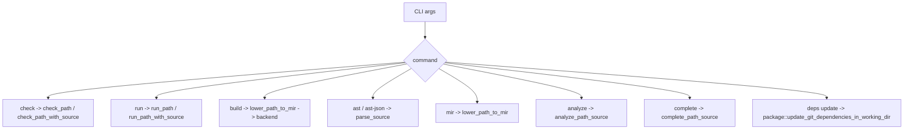

# CLI And Build Tools

This chapter explains how the `aura` CLI turns compiler library functionality into user-facing commands and build artifacts.

## What a compiler driver does

The compiler library knows how to parse, check, lower, analyze, and emit artifacts. A compiler driver is the layer that:

- reads command-line arguments
- reads files or stdin
- calls the right compiler library entrypoint
- renders errors
- writes outputs or artifacts

Aurora's driver lives in [`crates/aura/src/main.rs`](../crates/aura/src/main.rs).

## Aurora's command surface

The main command groups are:

- `check`
- `run`
- `build`
- `ast`
- `ast-json`
- `mir`
- `analyze`
- `complete`
- `deps update`

## Command dispatch



## File-backed and stdin-backed modes

Aurora's CLI supports both:

- ordinary file input
- editor-style stdin input with an associated virtual path

That is why `main.rs` has an `Input` struct and a `read_input` helper.

This matters because tools like the LSP often need to analyze the current buffer contents before the file is saved to disk.

## How `check` works

`check` is the simplest path:

1. read source
2. call `check_path` or `check_path_with_source`
3. print `ok` on success, or the empty schema-versioned report in JSON mode
4. render either the annotated human diagnostic or the compiler-owned
   structured JSON diagnostic on failure

The important architectural point is that diagnostics come from the compiler
library, not from ad-hoc CLI-specific parsing code. `check`, `run`, and `build`
select the renderer with `--format human|json`; both forms retain the stable
`AU####` code, and the structured form also retains related spans, notes, help,
and edits for downstream tools.

## How `run` works

`run`:

1. reads the source
2. checks it
3. lowers it to MIR
4. runs that MIR through the MIR runtime
5. writes captured stdout
6. exits with the integer value returned by the program when appropriate

### Phase 4 backend-selection invariant

Today, `aura run` is the MIR execution path by construction: it has no backend
selector, so the backend-parity gate can force MIR by invoking `aura run` and
force direct execution by building with `--backend direct`.

Phase 4 must preserve an explicit way to select each engine. The change that
adds backend selection to `run` must:

- add a real `aura run --backend mir` mode
- update `crates/aura/tests/backend_parity.rs` in the same change so its MIR
  leg passes `--backend mir` explicitly
- keep the direct leg explicit rather than using `auto` or another fallback

The parity gate must never infer that the default `run` backend is MIR. If a
future default changes to direct or automatic selection while the harness keeps
calling bare `aura run`, the test could compare direct execution with itself
and silently stop protecting MIR behavior.

## How `build` works

`build` is more complex.

### Direct backend path

For `--backend direct`, Aurora:

1. checks and lowers to MIR
2. asks `emit_host_native_object_with_metadata` for object bytes
3. ensures the Aurora runtime static library exists
4. writes temporary object/runtime files
5. invokes the host C compiler/linker
6. produces the final executable

### MIR-runtime launcher fallback

If `--backend auto` cannot use direct codegen successfully, Aurora can build a launcher binary that embeds:

- serialized MIR
- source path
- source text

That launcher calls `aurora_native_run(...)` from the runtime library.

This fallback is implemented through `build_mir_runtime_binary` in the CLI.

## Why the CLI embeds source in built binaries

Aurora preserves source path and source text metadata in build artifacts so runtime diagnostics can still render file, line, and caret context even after compilation.

That is a very user-visible product decision.

## A tiny compiler driver in Rust

This toy example shows the basic pattern of a driver calling library stages.

```rust
use std::fs;
use std::path::Path;

fn compile_file(path: &Path) -> Result<(), String> {
    let source = fs::read_to_string(path).map_err(|e| e.to_string())?;
    let module = parse(&source)?;       // lexer + parser
    let program = check(module)?;       // semantic analysis
    let mir = lower(&program);          // MIR lowering
    run(&mir)?;                         // runtime execution
    Ok(())
}

fn parse(_source: &str) -> Result<(), String> { Ok(()) }
fn check(_module: ()) -> Result<(), String> { Ok(()) }
fn lower(_program: &()) {}
fn run(_mir: &()) -> Result<(), String> { Ok(()) }
```

Aurora's real CLI adds:

- argument parsing
- multiple subcommands
- backend selection
- stdin path handling
- linker/runtime staging
- structured JSON output for editor tools

## Repo-level build and verification scripts

At the repo root, `package.json` defines workspace scripts such as:

- `build:extension`
- `check:lsp`
- `test:lsp`
- `coverage:lsp`
- `coverage:compiler`
- `ci`

Those scripts are part of Aurora's build-tooling story even though the core compiler is Rust. They keep the editor tooling and coverage gates in the same monorepo workflow.

## Files to study

- [`crates/aura/src/main.rs`](../crates/aura/src/main.rs)
- [`Cargo.toml`](../Cargo.toml)
- [`package.json`](../package.json)
- [`crates/aura/README.md`](../crates/aura/README.md)

## What comes next

Read [11-editor-tooling.md](11-editor-tooling.md) to see how editor features are built on top of the compiler.
