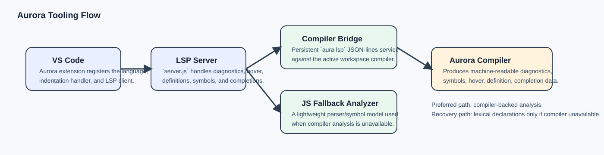
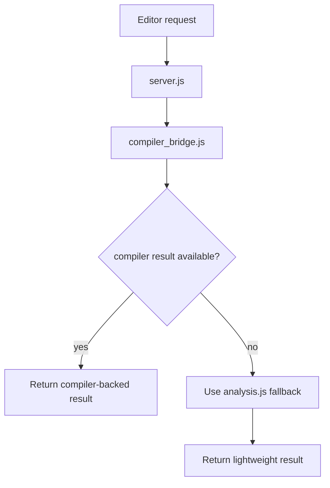

# Editor Tooling

This chapter explains how Aurora's editor experience is assembled from the compiler, the language server, and the VS Code extension.

## What a language server is

A language server is a long-running process that answers editor questions such as:

- what diagnostics should I show?
- what completions belong here?
- what symbol is under the cursor?
- where is its definition?
- what hover text should appear?

Aurora implements this in [`tools/aurora-language-server`](../tools/aurora-language-server).

## Aurora's tooling architecture

Aurora deliberately keeps the VS Code extension thin and pushes semantic work down into the language server and compiler.



## The main pieces

### VS Code extension

[`tools/vscode-aurora/src/extension.js`](../tools/vscode-aurora/src/extension.js):

- registers Aurora as a language
- starts the language client
- installs Aurora-specific newline indentation behavior
- watches `.au` files

### LSP server

[`tools/aurora-language-server/src/server.js`](../tools/aurora-language-server/src/server.js):

- manages documents and cached document state
- invalidates and revalidates the open-document compiler cache when imported files change
- handles LSP requests
- requests compiler-backed analysis when possible
- falls back when compiler analysis is unavailable

### Compiler bridge

[`tools/aurora-language-server/src/compiler_bridge.js`](../tools/aurora-language-server/src/compiler_bridge.js):

- locates the best `aura` command for the workspace
- runs `aura analyze --stdin ...`
- runs `aura complete --stdin ...`
- normalizes `file://` URIs through the shared helper in [`src/uri.js`](../tools/aurora-language-server/src/uri.js), including Windows UNC paths
- converts compiler output into LSP-shaped data

### Fallback analysis

[`tools/aurora-language-server/src/analysis.js`](../tools/aurora-language-server/src/analysis.js):

- provides lightweight document parsing/symbol logic
- handles basic completions, hover, definitions, and diagnostics
- is used when the compiler path cannot provide results

## Preferred path vs fallback path



This split is important:

- the compiler is the canonical semantic engine
- the fallback path keeps the editor usable in broken or incomplete buffers

## Why Aurora uses compiler-backed analysis

Aurora's compiler already knows:

- real types
- module resolution
- trait and method resolution
- diagnostics with source spans
- public/private visibility rules

That makes the compiler a better source of truth than a second independent semantic engine in JavaScript.

## What `analysis.rs` contributes

Aurora's compiler-facing analysis layer in [`analysis.rs`](../crates/aurora-compiler/src/analysis.rs):

- converts checked programs into diagnostics, symbols, hovers, definitions, and completions
- attempts recovery for common incomplete-editor states
- supports member completions and imported-module completions

That is what powers `aura analyze` and `aura complete`, which the LSP bridge consumes.

## Indentation behavior

Aurora's extension also includes a deliberately small but important editing feature in [`indentation.js`](../tools/vscode-aurora/src/indentation.js).

It detects block headers such as:

- `class`
- `def`
- `if`
- `match`
- `case`
- `with`
- `impl`

and inserts the correct next-line indent.

That is a good example of thin-client tooling: editor-specific mechanics stay in the extension, while semantics stay in the compiler/LSP.

## A tiny language-server architecture example

Here is the core pattern in plain terms:

```text
editor request
    -> language server
        -> compiler-backed query when available
        -> lightweight fallback if needed
        -> convert result into editor protocol objects
```

Aurora follows exactly that pattern.

## Files to study

- [`tools/aurora-language-server/src/server.js`](../tools/aurora-language-server/src/server.js)
- [`tools/aurora-language-server/src/compiler_bridge.js`](../tools/aurora-language-server/src/compiler_bridge.js)
- [`tools/aurora-language-server/src/analysis.js`](../tools/aurora-language-server/src/analysis.js)
- [`tools/vscode-aurora/src/extension.js`](../tools/vscode-aurora/src/extension.js)
- [`tools/vscode-aurora/src/indentation.js`](../tools/vscode-aurora/src/indentation.js)

## What comes next

Read [12-testing-and-quality.md](12-testing-and-quality.md) to see how this repo validates compiler and tooling changes.
