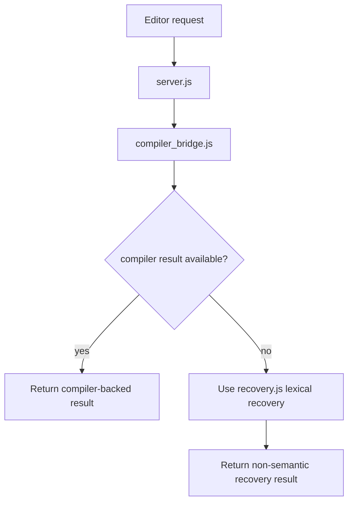

# Editor Tooling

This chapter explains how Aurora's editor experience is assembled from the compiler, the language server, and the VS Code extension.

## What a language server is

A language server is a long-running process that answers editor questions such as:

- what diagnostics should I show?
- what completions belong here?
- what symbol is under the cursor?
- where is its definition?
- what hover text should appear?

Aurora implements this in [`tools/aurora-language-server`](../tools/aurora-language-server).

## Aurora's tooling architecture

Aurora deliberately keeps the VS Code extension thin and pushes semantic work down into the language server and compiler.


## The main pieces

### VS Code extension

[`tools/vscode-aurora/src/extension.js`](../tools/vscode-aurora/src/extension.js):

- registers Aurora as a language
- starts the language client
- installs Aurora-specific newline indentation behavior
- watches `.au` files

### LSP server

[`tools/aurora-language-server/src/server.js`](../tools/aurora-language-server/src/server.js):

- manages documents and cached document state
- debounces edits and guards asynchronous results by document version
- invalidates only changed documents and their dependency consumers
- handles LSP requests
- requests compiler-backed analysis when possible
- falls back when compiler analysis is unavailable

### Compiler bridge

[`tools/aurora-language-server/src/compiler_bridge.js`](../tools/aurora-language-server/src/compiler_bridge.js):

- locates the best `aura` command for the workspace
- owns one persistent `aura lsp` process
- multiplexes newline-delimited JSON analysis and completion requests
- enforces cancellation, request timeouts, response limits, and process restart after failure
- normalizes `file://` URIs through the shared helper in [`src/uri.js`](../tools/aurora-language-server/src/uri.js), including Windows UNC paths
- converts compiler output into LSP-shaped data

### Lexical recovery

[`tools/aurora-language-server/src/recovery.js`](../tools/aurora-language-server/src/recovery.js):

- recovers declaration outlines and top-level names
- provides same-file hover/definition for those recovered declarations
- intentionally provides no semantic diagnostics or member type inference
- is used only when the compiler service cannot be started or has failed

## Preferred path vs fallback path



This split is important:

- the compiler is the canonical semantic engine
- compiler recovery handles ordinary incomplete buffers
- the lexical path keeps basic navigation available when the compiler process itself is unavailable without maintaining a second Aurora type system

## Why Aurora uses compiler-backed analysis

Aurora's compiler already knows:

- real types
- module resolution
- trait and method resolution
- diagnostics with source spans
- public/private visibility rules

That makes the compiler a better source of truth than a second independent semantic engine in JavaScript.

## What `analysis.rs` contributes

Aurora's compiler-facing analysis layer in [`analysis.rs`](../crates/aurora-compiler/src/analysis.rs):

- converts checked programs into diagnostics, symbols, hovers, definitions, and completions
- attempts recovery for common incomplete-editor states
- supports member completions and imported-module completions

That is what powers `aura analyze` and `aura complete`, which the LSP bridge consumes.

Method hover and completion signatures include the receiver contract. The
canonical spellings are `self` for a shared receiver, `own self` for a
consuming receiver, and `mut self` for a mutable receiver. Source
written as `self` therefore appears canonically as `self`. Compiler
diagnostics also preserve the teaching error for `self: Type`, while the
compiler-unavailable lexical recovery path includes the reserved `own` keyword
without attempting to duplicate receiver semantics.

Ordinary parameter hovers and completions render the declared ownership
contract as well. In particular, consuming APIs expose `own` in their
signatures, while a bare generic parameter remains a declaration-stable shared
borrow even if a later call specializes that generic to a copy type. Built-in
API detail follows the same rule, so calls such as `Vec.push(value: own T)` and
`Queue.put(value: own T)` do not hide a move behind editor shorthand.

## Indentation behavior

Aurora's extension also includes a deliberately small but important editing feature in [`indentation.js`](../tools/vscode-aurora/src/indentation.js).

It detects block headers such as:

- `class`
- `def`
- `if`
- `match`
- `case`
- `with`
- `impl`

and inserts the correct next-line indent.

That is a good example of thin-client tooling: editor-specific mechanics stay in the extension, while semantics stay in the compiler/LSP.

## A tiny language-server architecture example

Here is the core pattern in plain terms:

```text
editor request
    -> language server
        -> compiler-backed query when available
        -> lexical compiler-unavailable recovery if needed
        -> convert result into editor protocol objects
```

Aurora follows exactly that pattern.

## Files to study

- [`tools/aurora-language-server/src/server.js`](../tools/aurora-language-server/src/server.js)
- [`tools/aurora-language-server/src/compiler_bridge.js`](../tools/aurora-language-server/src/compiler_bridge.js)
- [`tools/aurora-language-server/src/recovery.js`](../tools/aurora-language-server/src/recovery.js)
- [`tools/vscode-aurora/src/extension.js`](../tools/vscode-aurora/src/extension.js)
- [`tools/vscode-aurora/src/indentation.js`](../tools/vscode-aurora/src/indentation.js)

## What comes next

Read [12-testing-and-quality.md](12-testing-and-quality.md) to see how this repo validates compiler and tooling changes.
