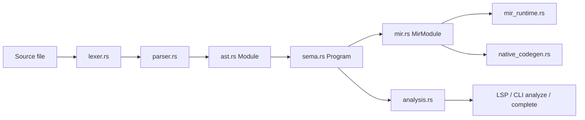

# End-To-End Walkthrough

This chapter follows one small Aurora program through the whole implementation stack.

## The program

```aurora
def add(left: int32, right: int32) -> int32:
    return left + right

def main() -> int32:
    return add(20, 22)
```

This example is intentionally small so you can see the whole pipeline without getting lost in language surface details.

## Stage 1: source text

At the beginning, Aurora only has bytes or UTF-8 text read from:

- a file path
- stdin with a virtual path
- an editor buffer passed through the language server bridge

## Stage 2: lexing

The lexer emits a token stream roughly like:

- `KwDef`
- `Identifier("add")`
- `LParen`
- `Identifier("left")`
- `Colon`
- `Identifier("int32")`
- `Comma`
- `Identifier("right")`
- `Colon`
- `Identifier("int32")`
- `RParen`
- `Arrow`
- `Identifier("int32")`
- `Colon`
- `Newline`
- `Indent`
- `KwReturn`
- `Identifier("left")`
- `Plus`
- `Identifier("right")`
- `Newline`
- `Dedent`

The second function is lexed the same way.

## Stage 3: parsing

The parser builds a `Module` containing two `FunctionDecl` items.

Important parsed facts:

- `add` has two typed parameters and a typed return
- its body is a `ReturnStmt`
- the returned expression is `Binary(Add, Name("left"), Name("right"))`
- `main` returns a call expression

## Stage 4: semantic analysis

The checker turns the AST into a `Program`.

At this stage Aurora now knows:

- `add` is a function in scope
- `left` and `right` are `int32`
- `left + right` is valid and has type `int32`
- `main` has no parameters, which satisfies Aurora's entrypoint rule
- the `return` statements match their declared return types

## Stage 5: MIR lowering

Aurora then lowers the checked functions into `MirFunction` bodies.

A simplified MIR sketch for `add` might look like:

```text
entry:
  tmp0 = Binary(Add, Place("left"), Place("right"))
  Return(Place("tmp0"))
```

A simplified sketch for `main` might look like:

```text
entry:
  tmp0 = Call(Name("add"), [Int(20), Int(22)])
  Return(Place("tmp0"))
```

The real MIR contains more metadata such as local types and block labels, but this is the core idea.

## Stage 6a: `aura run`

If the user runs:

```text
aura run file.au
```

Aurora:

1. executes `main` in the MIR runtime
2. binds the integer arguments to `add`
3. evaluates the `Binary(Add, ...)`
4. returns the result as `Value::Int`
5. exits the process with that integer value when appropriate

## Stage 6b: `aura build`

If the user runs:

```text
aura build -o ./program file.au
```

Aurora:

1. lowers to the same MIR
2. feeds that MIR to the direct backend
3. emits an object file
4. links it against Aurora's runtime library
5. writes the final executable

The compiled binary still knows enough source metadata to render runtime diagnostics.

## Stage 7: tooling view

If the file is open in VS Code:

- the language server multiplexes diagnostics, symbols, hover, definitions, and completions through one persistent `aura lsp` process
- compiler recovery handles common incomplete-buffer states
- if the compiler process is unavailable, the server uses lexical declaration recovery rather than a second semantic analyzer

So the same compiler pipeline also powers editor features.

## The whole flow in one diagram



## What this walkthrough teaches

The key architectural point is that Aurora has a clean staged pipeline:

- syntax is separated from semantics
- semantics are separated from execution
- MIR is the hinge point between checking and backend execution
- tooling reuses compiler knowledge instead of rebuilding it from scratch

That separation is what makes the repo understandable and extensible.
