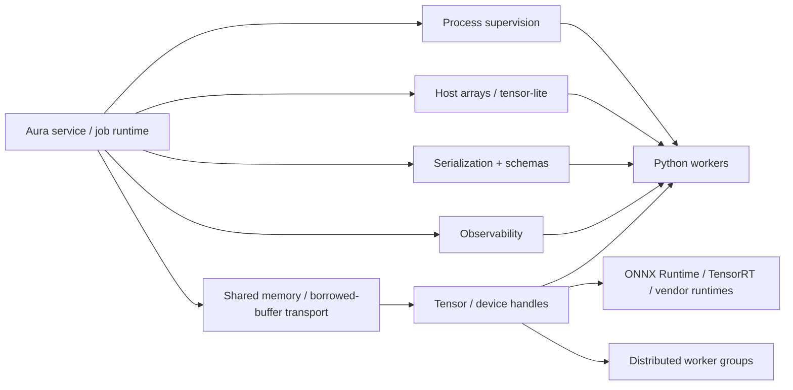

# Aura ML Systems Support Plan

Status: the control-plane baseline and contiguous numeric `Array` subset are
implemented. Other sections describe design objectives outside the current
language contract.

This document describes how Aura can become a strong ML systems language without trying to replace Python or PyTorch for model training.

The intended split is:

- Aura owns orchestration, serving, supervision, transport, artifact movement, observability, and systems composition.
- Aura should also be able to handle moderate local numeric and data-processing work directly, especially for preprocessing, postprocessing, evaluation glue, and batch shaping.
- Python and existing accelerator-aware runtimes continue to own most training, large tensor-heavy model execution, and vendor-specific kernel stacks.

Aura already has useful foundations for that direction:

- queue/task concurrency and scheduler-backed waits
- file, socket, HTTP, WebSocket, Unix-socket, and TLS I/O
- a MIR runtime plus a direct native backend
- ownership, borrowing, cleanup, and package support
- shell-free process execution, pipes, timeouts, process groups, and supervisors
- program arguments, environment, paths, working-directory access, and clocks
- recursive dynamic JSON values with typed parse errors and deterministic
  dumping, plus typed `Map[String, String]` JSON/TOML compatibility codecs
- structured log/trace records and process-local counters
- certificate-validated HTTPS plus chunked HTTP framing

See:

- [README.md](../README.md)
- [tutorials/13-concurrency.md](../tutorials/13-concurrency.md)
- [tutorials/19-io-and-networking.md](../tutorials/19-io-and-networking.md)
- [architecture_docs/08-native-codegen-and-runtime.md](../architecture_docs/08-native-codegen-and-runtime.md)

## Goal

Make Aura excellent for ML systems work such as:

- inference serving and routing
- embedding pipelines
- retrieval and reranking orchestration
- local numeric preprocessing and postprocessing
- offline batch scoring
- evaluation at scale
- model and artifact conversion workflows
- accelerator-aware service composition
- distributed job control and failure handling

without turning Aura into a PyTorch clone or requiring Aura-native training APIs first.

## Non-goals

This roadmap does not aim to make Aura the first place users write:

- autograd engines
- optimizer implementations
- `nn.Module`-style training stacks
- vendor kernel libraries
- a full replacement for PyTorch, JAX, or similar frameworks

Those may become future integrations, but they are not the first milestone.

## Problem Statement

Aura now has a usable first control-plane boundary, but it is still missing the data-plane and exporter depth a production ML systems language needs:

- no maintained host-side dense-array surface for local numeric work
- no maintained shared-memory or copy-avoiding borrowed-buffer transport surface
- no schema-derived class and enum codecs or binary serialization format
- no external metrics exporter, scoped trace spans, or profiler integration
- no public tensor or device handle model for the later accelerator-aware path

That means Aura can already act as a control-plane language, but it cannot yet act as a strong local ML runtime boundary between Python workers, model servers, accelerators, and artifact pipelines.

## Design Principles

1. Do not replace Python training.
   Aura should interoperate with Python workers and model runtimes rather than competing with them immediately.

2. Make system boundaries first-class.
   Process supervision, transport, observability, deadlines, and structured failure handling are the first priorities.

3. Let Aura do useful local numeric work itself.
   Basic array-style operations for dense CPU-side data should be part of Aura's maintained surface so small preprocessing and evaluation steps do not always require a Python hop.

4. Stage tensor ambition deliberately.
   Start with host-side dense arrays for NumPy-style data processing. Add tensor and device handles next. Treat full tensor placement, accelerator execution, and distributed semantics as later phases.

5. Prefer capability-based placement over universal device residency.
   Not every Aura value should live on every accelerator. Tensors, numeric buffers, and device-capable plain data should be placeable; sockets, files, queues, and many service handles should remain host-bound.

6. Keep semantics explicit.
   Cross-device transfer, copy-avoiding borrowing, ownership handoff, and distributed collectives should be explicit in the type system and runtime protocol.

## Target Architecture

The long-term idea is:

- Aura manages the workflow and runtime envelope.
- Aura can directly handle ordinary CPU-side array transforms and data shaping.
- Python or native model runtimes execute the tensor-heavy and accelerator-heavy work.
- Tensor, device, and transport metadata eventually become visible to Aura, even when Aura does not own the kernel implementation.

## Core Feature Pillars

## 1. Subprocess And Process Supervision

Aura needs a maintained process API for local Python workers, tokenizers, converters, model servers, and artifact tools.

### Why this matters

Without a public process model, Aura has to treat Python as only a network service. That is too weak for many local or single-host ML systems workflows.

### Required surface

- `Command`
- `Child`
- `ExitStatus`
- `Stdio`
- pipes for stdin/stdout/stderr
- environment and working-directory control
- structured shutdown and escalation
- restart and backoff helpers
- supervision groups
- streaming line and byte readers

### Language/runtime changes

- new builtin process/resource types
- cancellation-aware waiting on child exit and pipe readiness
- `with` support for child processes and pipe resources
- scheduler integration for nonblocking local I/O
- runtime diagnostics for spawn failures, timeouts, and abnormal exits

### Examples Aura should eventually support

- supervise a pool of Python embedding workers
- launch a tokenizer sidecar and stream requests over stdin/stdout or Unix sockets
- run checkpoint conversion tools with structured retries and artifact capture

## 2. Host-Side Array / Tensor-Lite Support

Aura should gain a small maintained dense-array surface for ordinary numeric data processing even if Python remains the place for training and accelerator-heavy execution.

### Why this matters

Without a local numeric layer, even trivial preprocessing and postprocessing steps become Python RPC calls or subprocess invocations. That is unnecessary friction for batching, masking, normalization, statistics, and other common ML systems glue code.

### Maintained first model

Phase 7.3 establishes the global `Array[T]` surface for exactly `int32`,
`int64`, `float32`, and `float64`. It has rank-at-least-one shape metadata,
contiguous row-major CPU storage, exact-shape same-dtype elementwise kernels,
first-axis owned-copy slicing, mapping, and basic reductions.

### Follow-on operations

- broadcasting where shapes are compatible
- views
- reshape and transpose
- reductions beyond the maintained `sum`, `mean`, `min`, and `max`
- matrix multiply for ordinary CPU-side data work

### Language/compiler changes

- new builtin array-like type names and metadata
- checker support for numeric-array operators and shape-compatible indexing or slicing rules
- diagnostics for incompatible dtypes, ranks, and broadcast patterns
- analysis/completion support for the maintained array APIs
- MIR operations or runtime intrinsics for allocation, views, reductions, and matmul

### Explicit non-goals for the first step

- no autograd
- no optimizer or training APIs
- no accelerator placement yet
- no distributed array semantics yet
- no requirement that this initial layer match PyTorch exactly

## 3. Structured Serialization

Aura needs a maintained serialization story for service requests, manifests, evaluation outputs, and artifact metadata.

### Required formats

- JSON as the baseline human-readable format
- MessagePack or CBOR for compact structured RPC
- Protobuf or a schema-based binary format for strongly typed service boundaries
- Arrow and safetensors for data-heavy ML-specific cases

### Required language/runtime surface

- implemented: recursive `json.Value`, typed `json.Error`, exact accessors,
  deterministic dumping, and fixed resource limits
- schema-derived encoding and decoding for Aura classes and enums
- streaming encoders and decoders
- typed error reporting for schema mismatches
- versioning and compatibility rules for evolving message contracts

### Compiler/tooling changes

- derive-like or explicit codec declarations
- diagnostics for unsupported serialized shapes
- package support for generated schema code if code generation is adopted

### Scope note

Structured serialization should be treated as part of the ML systems runtime plan, not as a generic afterthought. Many ML systems failures happen at RPC and artifact boundaries, not in model kernels.

## 4. Observability

Aura needs first-class observability so ML systems built in Aura can be debugged and operated under load.

### Required surface

- structured logs
- counters, gauges, histograms
- tracing spans
- trace propagation across tasks and child processes
- profiling hooks
- service-health and queue-depth instrumentation

### Required semantics

- cancellation and timeout reasons should be observable
- process restarts and worker failures should produce machine-readable events
- resource transfers and device synchronizations should be traceable
- serialization and transport boundaries should expose latency and size metrics

### Tooling/runtime changes

- standard observability modules
- native runtime support for clocks, timers, and trace contexts
- scheduler instrumentation
- process supervision hooks for child lifecycle events
- optional OpenTelemetry-compatible export path

## 5. Shared-Memory And Copy-Avoiding Transport

Aura needs a real local data plane, not only strings and copied byte buffers.

### Why this matters

Without a maintained shared-memory, copy-avoiding transport, Aura remains a
copying boundary between Python and accelerator-aware runtimes. That is
acceptable for orchestration, but weak for high-throughput inference,
embedding systems, and local array-heavy pipelines. Shared-memory transport is
outside the current public API.

### Required surface

- memory-mapped files
- shared-memory regions
- borrowed byte slices or buffer views
- file-descriptor passing on Unix where supported
- pinned host buffers
- foreign buffer handles for accelerator runtimes
- local transport primitives that can hand off buffers safely

### Interop targets

- DLPack
- Arrow IPC / columnar batch formats
- safetensors for artifact movement
- raw shared-memory tensor buffers with metadata side channels

### Runtime/compiler changes

- new resource types for shared memory and mapped files
- ownership and borrowing rules for shared buffers
- explicit copy vs borrow vs move semantics
- scheduler-aware readiness and cleanup support
- native runtime ABI support for buffer-backed foreign values

## 6. Tensor And Device Handle Interop

Aura should gain first-class awareness of tensors, devices, accelerators, and execution placement without requiring Aura-native training code first.

### Minimum model

- `Device`
- `TensorHandle`
- `DType`
- `Shape`
- `Stride`
- `DeviceBuffer`
- `Stream`
- `Event`

### Important rule

These should begin as foreign or runtime-managed handles, not necessarily as fully materialized Aura-native tensor values with rich shape inference and kernel lowering on day one.

### Required semantics

- ownership of handles
- explicit retain/release or borrow rules for foreign buffers
- explicit transfer between host and device
- explicit synchronization boundaries
- clear distinction between host values, device-capable values, and distributed values

### Language/compiler changes

- new builtin type names and metadata
- placement-aware type checking for device operations
- diagnostics for invalid cross-device use
- analysis/completion support for tensor and device APIs
- MIR operations or runtime intrinsics for transfer, synchronization, and handle inspection

## Full Tensor, Accelerator, And Distributed Boundary

Full tensor placement, accelerator execution, and distributed collectives are
outside the current language contract.

### Full tensor support would likely include

- placement-aware tensor values instead of handles alone
- tensor-aware operator semantics for `+`, `-`, `*`, `/`, and explicit contraction such as `@`
- richer shape rules, broadcasting rules, and view semantics
- stream-aware execution and synchronization semantics
- accelerator-aware allocation and transfer APIs

### Distributed support would likely include

- process groups or device meshes
- collectives such as broadcast, all-reduce, all-gather, and reduce-scatter
- replicated and sharded tensor metadata
- placement-aware task and worker scheduling
- cross-node observability, failures, and trace propagation

### Important scoping rule

Aura should only take on this broader tensor and distributed surface after the smaller host-side array layer, process supervision, serialization, observability, and local high-throughput transport are stable.

## Language And Runtime Changes Needed

The feature pillars above imply several cross-cutting changes.

## Type System

Aura should first grow a clear host-side numeric capability model, then later expand that model to placement-aware execution:

- host-side numeric arrays
- host-only values
- device-capable values
- distributed values

That does not mean every type can live on every device. A better model is:

- host-side arrays remain ordinary Aura-managed values
- `TensorHandle`, `DeviceBuffer`, and selected plain-data aggregates are placeable later
- `File`, `TcpStream`, `HttpExchange`, `Queue[T]`, and similar runtime resources remain host-bound
- transferability and distributability are explicit capabilities, not universal assumptions

## Ownership And Borrowing

Aura's ownership model is a good fit for ML systems, but it needs extensions for both host-array views and foreign/device resources:

- borrowed access to array slices and views
- borrowed access to shared-memory buffers
- owned transfer of device handles
- lifetime-safe aliasing rules for copy-avoiding borrowed views
- explicit synchronization requirements before host reads
- diagnostics for invalid use after cross-process or cross-device handoff

## MIR And Runtime

Aura's execution model will need new intrinsics or runtime calls for:

- process spawn/wait/kill
- host-array allocation, slicing, reductions, and matmul
- pipe and socket readiness
- shared-memory creation and mapping
- tensor-handle import/export
- device transfer and synchronization
- observability events and metrics emission

The current MIR and native backends should keep sharing these concepts through common runtime abstractions instead of forking their behavior.

## Native Runtime ABI

The direct runtime will need a broader foreign-resource model:

- opaque process handles
- opaque shared-buffer handles
- opaque tensor/device handles
- explicit retain/release semantics
- stable ABI boundaries for native plugins and runtime adapters

## Compiler-Backed Tooling

The language server and analysis surface should understand new ML systems types:

- process and pipe APIs
- host-side array helpers
- tensor/device handles
- serialization helpers
- observability helpers

That means completions, hover text, diagnostics, and definition links must stay compiler-owned for the new surface.

## Roadmap

## Phase 1: ML Control-Plane Foundation

Status: baseline complete in Aura 0.1.

Primary goal: make Aura strong for service orchestration and Python worker supervision.

Deliverables:

- implemented: process/subprocess API and supervision
- implemented: scheduler-aware child I/O
- implemented: structured JSON log and trace events
- implemented: process-local counter metrics baseline
- implemented: recursive JSON values, typed parse failures, deterministic
  compact/pretty dumping, and exact accessors
- implemented: typed string-map JSON/TOML codecs
- implemented: args/environment/path/time host APIs and HTTPS/chunked HTTP

Follow-on depth within this phase includes schema-derived codecs, streaming
serialization, metrics exporters, scoped spans, profiling, redirect/pooling
HTTP behavior, and higher-level custom-CA HTTP configuration.

Success criteria:

- Aura can supervise local Python worker pools robustly
- Aura services can expose machine-readable telemetry
- Aura can stream structured requests and responses without shell-script glue

## Phase 2: Host-Side Array / Tensor-Lite Layer

Status: the first contiguous numeric `Array` subset is complete; broader
tensor operations are outside the current public API.

Primary goal: let Aura perform useful local numeric data-processing work directly.

Deliverables:

- implemented: dense host-side `Array[T]` values with four maintained dtypes
- implemented: exact-shape arithmetic, first-axis owned slices, and basic
  reductions
- outside the current API: broadcasting, reshape, transpose, additional
  reductions, and views
- matrix multiply for local CPU-side transforms
- examples for preprocessing, postprocessing, and evaluation helpers

Success criteria:

- Aura can express common numeric data-shaping steps without immediately delegating to Python
- small ML systems tasks such as masking, normalization, batching, and statistics are practical directly in Aura

## Phase 3: Local High-Throughput Interop

Primary goal: remove avoidable host copies and weak local IPC boundaries.

Deliverables:

- shared-memory buffers
- mapped files
- borrowed buffer views
- Unix descriptor-passing support where available
- binary framing and schema-aware codecs

Success criteria:

- Aura can coordinate local Python workers using shared memory plus control sockets
- large payloads no longer require repeated string or byte copying through ad hoc layers

## Phase 4: Tensor And Device Handle Core

Primary goal: make tensors and accelerators visible to Aura as first-class runtime concepts.

Deliverables:

- `Device`, `TensorHandle`, `DeviceBuffer`, `DType`, `Shape`, `Stride`
- import and export adapters for DLPack-class interop
- placement-aware diagnostics
- explicit transfer and synchronization APIs

Success criteria:

- Aura can move tensor-backed work units across service boundaries without losing device metadata
- Aura can coordinate Python and native model runtimes using a shared placement model

## Phase 5: Full Tensor And Placement-Aware Execution

Primary goal: make device execution a coherent language concept rather than an FFI detail.

Deliverables:

- placement-aware execution contexts
- optional tensor-aware core operators
- stream and event semantics
- explicit host/device transfer syntax or library surface
- richer tensor semantics beyond foreign handles

Success criteria:

- Aura code can express ML systems control logic that is aware of host/device placement directly
- common device mistakes surface as compile-time or structured runtime diagnostics

## Phase 6: Distributed Runtime Primitives

Primary goal: make Aura a strong distributed ML systems control language.

Deliverables:

- process groups or meshes
- distributed worker supervision
- collective-operation handles
- replicated and sharded tensor metadata
- cross-node observability and trace propagation

Success criteria:

- Aura can orchestrate multi-host evaluation, inference, and artifact workflows with first-class distributed concepts

## Testing And Verification Strategy

When these features become real implementation work, Aura should treat them like the rest of the maintained language surface:

- compiler tests for new syntax and type rules
- MIR and native backend parity tests for new runtime intrinsics
- runtime regression tests for process supervision, transport, array semantics, and device-handle safety
- example smoke tests for maintained ML-systems workflows
- language-server regression tests for the new public APIs
- updated tutorials and README sections only for features that are actually implemented

Examples required before admitting additional surface:

- `examples/ml/process_pool/`
- `examples/ml/arrays/`
- `examples/ml/shared_memory/`
- `examples/ml/inference_gateway/`
- `examples/ml/eval_orchestrator/`
- `examples/ml/checkpoint_conversion/`

## Recommended Priorities

If Aura can only fund a small number of milestones first, the recommended order is:

1. host-side array / tensor-lite support
2. schema-derived and binary serialization depth
3. copy-avoiding shared-memory transport
4. production observability exporters and profiling
5. tensor/device handle interop
6. full tensor, placement-aware execution, and distributed runtime work

That order intentionally makes Aura strong at ML systems operations and practical local data processing before Aura becomes ambitious about full accelerator-native tensor execution.

## Summary

Aura does not need to replace Python training to become a strong ML systems language.

It does need to become excellent at:

- supervising Python and native worker processes
- handling ordinary local numeric data work directly
- moving structured data safely and efficiently
- exposing logs, metrics, and traces as first-class runtime concepts
- understanding tensor, device, and accelerator handles as real language-level resources later on

If Aura gets those boundaries right, it can become a serious ML systems language while still using Python and existing runtimes for the tensor-heavy parts that already work well today.
